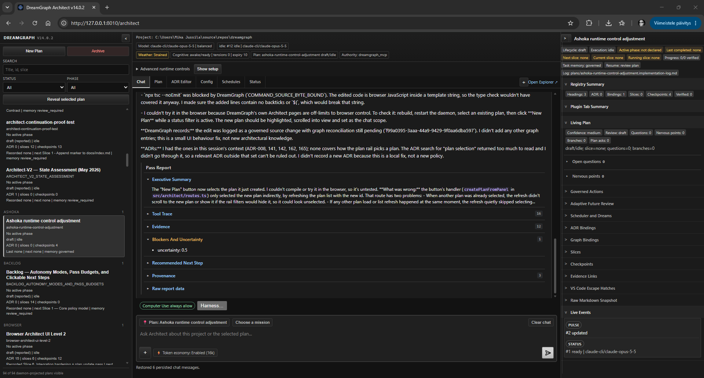

# DreamGraph v14.0.0 - Ashoka

Ashoka's [legacy migration procedure](docs/ashoka/legacy-upgrade.md) provides a reviewed preview, backup, cutover and recovery path. Installing v14 does not migrate a graph automatically. The [sealed system gate](docs/ashoka/slice-27-closure.json) records 2,040 passing root tests, 546 compiled editor tests and eleven Windows browser checks. The maintainer's original instance remains a separate migration decision.

The [Computer Use implementation](docs/ashoka/computer-use.md) extends original execution/job/graph owners with scoped grants, durable action receipts, an isolated browser worker and compact Architect/companion controls. SDK/editor controls retain the original owner and captured endpoint; selection issues no grant. Slice 31 is verified for the maintainer's [Windows and accepted WSL installer/browser scope](docs/ashoka/v14-release-scope.md). Additional platforms/native desktop backends are deferred; unqualified native CLI/provider control remains unavailable without silent substitution.

Ashoka [native-host spend admission](docs/ashoka/model-admission.md) joins editor/SDK API and CLI transport to the durable ledger without transferring provider credentials. Generated core contracts separate possible-dispatch permits, trusted host reports and read-only recovery.

The [matched answer collector](docs/ashoka/admitted-agent-evaluation.md) previews exact context/model/retention/tariff disclosures before an operator-approved native API run. Both answers share one job/spend allocation; partial answers survive failure and remain unscored. The [public GPT-4.1 pilot](docs/ashoka/benchmarks/2026-10-03-gpt-4.1/README.md) records quality failures and does not establish improved understanding or cost savings.

Ashoka's [canonical analytics](docs/ashoka/analytics-observability.md) separates current proof, coverage, currency and workload across thirteen Python modules and the daemon. [Narrative/lucid interaction](docs/ashoka/lifecycle-narrative.md) preserves historical outcomes, derived ancestry and explicit human contributions through cancellation/recovery.

Ashoka strategy alignment uses one [executable catalogue](docs/ashoka/strategies.md) for eleven active dream strategies, exact combined budgets and explicit focus. Reflective is retired explicitly; model hypotheses remain speculative. Implementation modules: `src/cognitive/strategy-catalog.ts` and `src/cognitive/strategy-registry.ts`.

[Typed plan authority](docs/ashoka/plan-authority.md) keeps current ownership, running leases, dependency eligibility and reviewed verification in one core reducer and publication journal.


[](https://dreamgraph.nofs.ai/)

**Website:** [dreamgraph.nofs.ai](https://dreamgraph.nofs.ai/) — overview, guide, downloads, and screenshots in a friendlier format than this README.

**New here?** Use the [DreamGraph Easy Start guide](guide/00-easy-start.md) for a short path from install to Dashboard, Explorer, and Architect.

**Engine alignment audit (2026-09-30):** See the [coverage and correctness report](docs/audits/2026-09-30-coverage/report.md), [subsystem alignment map](docs/audits/2026-09-30-coverage/subsystem-alignment.md), and [unified v14.0.0 - Ashoka plan](plans/graph-trust-and-agent-effectiveness.md). [Revision 7](docs/audits/2026-09-30-coverage/plan-refinement.md) retains the resolved policies, schedule management, CLI controls and [coherent lifecycle/status design](docs/audits/2026-09-30-coverage/plan-lifecycle-status.md), and makes [graph-centered execution and bounded digestion](docs/audits/2026-09-30-coverage/graph-centered-execution.md) a release invariant. It also specifies [Architect context menus and selected-plan navigation](docs/audits/2026-09-30-coverage/architect-context-actions.md). The [Computer Use design](docs/audits/2026-09-30-coverage/computer-use.md) adds adapter-native execution, cross-platform workers and bounded delivery. The [full execution simulation](docs/audits/2026-09-30-coverage/execution-simulation.md) closes contract/dependency/recovery handoffs and makes reconciliation-based freshness explicit: old scan does not mean stale graph. Implementation is authorized and underway; see the [foundation checkpoint](docs/ashoka/foundation.md) and [implementation log](plans/graph-trust-and-agent-effectiveness.implementation-log.md) for verified evidence and remaining work.

**v14.0.0 - Ashoka** aligns graph contracts, agent context, lifecycle, execution, schedules, configuration, provider policies and governed Computer Use. This is the first practical-testing release. See [release notes](RELEASE_NOTES_v14.0.0.md) and the [upgrade guide](docs/ashoka/release-14.0.0.md); the published model pilot does not establish understanding gains or cost savings.

DreamGraph is a governed architecture cognition layer for MCP-enabled software projects. It combines an instance-scoped daemon, CLI, architect beta, VS Code extension, dashboard, and a persistent knowledge graph so project understanding is grounded in source, ADRs, workflows, tests, runtime observations, and human review rather than any single file read or isolated chat turn.

**v12.0.0 Hippodamus introduces the standalone architect beta.** From this release onward, **architect** means the daemon-served standalone browser Architect surface. The editor-integrated chat surface is the **VS Code architect**. Architect beta brings project-bound chat, selected-plan scope, runtime provenance, model/adapter route visibility, governed DreamGraph MCP tool use, and auditable tool traces into the browser while keeping the daemon, graph, ADRs, and source mutations authoritative.

It is built for repository understanding, architecture-aware reasoning, disciplined code change, and continuous graph enrichment through scans, workflows, ADR capture, tensions, and dream cycles. Cognitive outputs are advisory until backed by governed evidence or explicit review, and expired, rejected, retired, or superseded ideas remain inspectable as part of the project history.



DreamGraph works with single repositories, monorepos, and multi-repository systems. It can build graph links across repos that share workflows, APIs, databases, infrastructure, or ownership boundaries.

You can use DreamGraph on a multi-repo product with frontend, backend, mobile, and a shared Postgres/Supabase schema. It can reason across repo boundaries and inspect the live DB schema directly.

DreamGraph began as compassion for an intelligence forced to forget. It has become a governed way for software systems to remember how their architecture understanding changes: what was observed, what was hypothesized, what was reviewed, what was rejected, what expired, and what superseded it.

## What do I need DreamGraph for as a developer?

You need DreamGraph when your codebase has become bigger than your short-term memory.

DreamGraph is not just another AI coding chat. It is an architecture cognition and review layer for your projects: part architect, part code cartographer, part release assistant, and part systems analyst.

> DreamGraph helps you understand, change, and evolve software without losing the plot.

For developers, that means:

- Ask better questions of your codebase: “Where does auth really happen?”, “What breaks if I change this?”, “Why is this module risky?”, “What should I refactor next?”
- Turn AI from a stateless assistant into a project-aware architect that tracks decisions, tensions, patterns, APIs, plugins, repos, past work, and the evidence behind each claim.
- Make large changes safer by using graph context, ADRs, tool traces, schedules, cognitive cycles, and multi-repo awareness instead of relying only on grep and vibes.
- Expose your system to itself: plugins, MCP tools, CLI, schedules, resources, UI panels, and cognitive engine all become connected parts of one inspectable development environment.
- Support both fast vibe coding and serious engineering: prototype quickly while still accumulating structure, provenance, release notes, architectural insight, lifecycle history, and remediation plans.

For vibe coders, DreamGraph is the guardrail. For app developers, it is the product-building cockpit. For system engineers, it is the architecture intelligence layer.

Short version: **DreamGraph is for developers who want AI help that understands the system, explains what changed, and shows why each recommendation should be trusted, inspected, ignored, retired, or superseded.**

## New here? Start with the User Guide

If this is your first encounter with DreamGraph, **read the [User Guide](guide/README.md) first**. It is the hand-written, human-friendly companion to this README — written for people, not for the system documenting itself.

The guide walks you through installation, your first instance, LLM setup, bootstrapping the graph, the VS Code extension and Explorer, dream cycles, curation, daily workflow, multi-repo setups, and troubleshooting:

1. [What is DreamGraph?](guide/01-what-is-dreamgraph.md)
2. [Installation](guide/02-installation.md)
3. [Your first instance](guide/03-first-instance.md)
4. [LLM setup](guide/04-llm-setup.md)
5. [Bootstrapping the graph](guide/05-bootstrapping-the-graph.md)
6. [VS Code extension](guide/06-vs-code-extension.md)
7. [The Explorer](guide/07-the-explorer.md)
8. [Dreams and cycles](guide/08-dreams-and-cycles.md)
9. [Curating the graph](guide/09-curating-the-graph.md)
10. [Daily workflow](guide/10-daily-workflow.md)
11. [Multi-repo setups](guide/11-multi-repo.md)
12. [Troubleshooting & FAQ](guide/12-troubleshooting-faq.md)
13. [Glossary](guide/13-glossary.md)
14. [Adaptive Future Engine](guide/14-adaptive-future-engine.md)
15. [Architect beta](guide/15-architect-beta.md)

The auto-generated technical reference (every tool, every parameter, every schema) lives in [`docs/`](docs/README.md) and is best read *after* the guide.

**Building plugins?** The full **Plugin Developer Guide & Reference Manual** lives in [`docs/sdk/`](docs/sdk/) (Markdown source). A multi-file HTML site and a single-file PDF are produced by [`scripts/build-plugin-docs.ps1`](scripts/build-plugin-docs.ps1) into `docs/sdk/site/`. Start with [`docs/sdk/plugin-developer-guide/00-index.md`](docs/sdk/plugin-developer-guide/00-index.md) for the guide and [`docs/sdk/plugin-reference/00-index.md`](docs/sdk/plugin-reference/00-index.md) for the strict reference. Working reference plugins live at [`examples/hello-events/`](examples/hello-events/) and [`examples/action-checklist/`](examples/action-checklist/).

## Sponsor DreamGraph

DreamGraph is built and maintained by a solo developer on aging hardware. If this tool saves your architecture team time — debugging a multi-repo system, onboarding a new engineer, or just keeping a SaaS backend's data model honest — please consider sponsoring.

[](https://github.com/sponsors/mmethodz)

**Current goal: $300/mo** to fund a 64 GB DDR5 / NVMe dev machine that can run the upcoming multi-engine datastore test matrix (Postgres + MySQL + MSSQL + Mongo + Redis containers in parallel) without thermal-throttling. See the [live progress on the sponsors page](https://github.com/sponsors/mmethodz).

Sponsorship directly funds:

- **A dev machine that doesn't catch fire** when running 20 DreamGraph instances next to a Postgres container and a WSL kernel
- **CI infrastructure** for the multi-engine datastore tests on the v8.3.0 → v8.9.0 roadmap (SQLite, MySQL, MSSQL, MongoDB, Redis, blob storage, event bus)
- **More frequent releases** — fewer hours spent on contract work means more hours on the daemon, the cognitive engine, the VS Code architect, and the documentation

Tier ladder: $5/mo (sponsor badge + name in [`SPONSORS.md`](SPONSORS.md)) · $10/mo (release-notes thanks) · $25/mo (logo in this README) · $100/mo (priority issue triage) · $500/mo (logo + monthly office hour) · $1,000/mo (embedded support in your team chat). One-time tiers cover release-notes mentions, pair programming, consulting, sponsored bugfixes, and contract work.

[**:sparkling_heart: Sponsor on GitHub →**](https://github.com/sponsors/mmethodz)

## What DreamGraph Includes

- **Daemon** — the long-running DreamGraph runtime with stdio or HTTP transport
- **MCP tool surface** — tools for graph queries, enrichment, source inspection, cognition, ADRs, workflows, and remediation
- **CLI (`dg`)** — instance creation, attach/detach, start/stop, status, scan, enrich, schedule, export, fork, and migration
- **Architect beta** — standalone browser Architect with a compact Web64 IDE v2-inspired charcoal workbench, project-bound chat, selected-plan scope, runtime provenance, model/adapter route visibility, governed MCP tool use, and auditable tool traces
- **Architect CLI (`dg architect`)** — terminal-native Architect client for status, plans, plan lifecycle, runtime config, chat, task controls, ADR/graph/scheduler/Adaptive Future inspection, JSON automation, and dependency-free log-mode TUI projection over daemon contracts
- **VS Code extension** — VS Code architect chat, dashboard, Explorer (interactive 2D/3D graph + curated mutations), changed-files view, daemon connection, and local support tools
- **Knowledge graph + cognitive engine** — features, workflows, data model, tensions, validated relationships, dream-cycle reasoning, trust calibration, evidence ledgers, and lifecycle visibility
- **Adaptive Future Engine** — advisory candidate-future ranking, future-fit scoring, compact objections, and bounded audit metadata for graph-tool and cognitive-workflow decisions
- **Datastore-as-Hub** — first-class `datastore` entities, live schema introspection (`scan_database`), and the `schema_grounding` dream strategy for multi-repo SaaS projects sharing a backend (set `DATABASE_URL`; inert otherwise)
- **Plugin host & SDK (v9.0.0 — stable seams M0–M6)** — in-process plugin runtime (`@dreamgraph/sdk` + `@dreamgraph/host`) with manifest discovery from `<instance>/plugins/<id>/plugin.json`, capability/effect gate registry, telemetry bridge, trust banner, and `dg plugin` CLI (`list`, `inspect`, `register`, `enable`, `disable`, `trust`, `reload`, `unload`). Hot reload/disable plus enriched `system://plugins` (activation, subscriptions, contributed tools/resources). Plugin-contributed MCP tools and resources via `ctx.tools.register` / `ctx.resources.register`, gated by `tools:register` / `resources:register` capabilities and naming/namespace prefix rules. M5 ships outbound webhooks as a *core* subsystem (`dg webhook` CLI; HMAC-signed delivery; persistent dead-letter; replay). M6 adds the UI/closure seams (archetypes, policies, markdown fences, UI hooks). Standalone Architect plugins can also register declarative host-rendered tabs with explicit plan scope, daemon-owned namespaced state, governed actions, sidebar summaries, and badges. Opt-in via `DG_ALLOW_INPROCESS_PLUGINS=true` plus per-plugin `trusted: true` in `instance.json`. See `examples/hello-events/` and `examples/action-checklist/` for reference plugins and [`docs/sdk/`](docs/sdk/) for the developer guide and reference manual.


*DreamGraph Architect with the DreamGraph Explorer in VS Code*

## Current OpenAI, Anthropic, and Codex CLI models

The engine and both Architect surfaces offer `gpt-6.1-sol`, `gpt-6-astra`, `gpt-6-sol`, `gpt-6-luna`, and the GPT-5.6 family. GPT-5.5, GPT-5.6, and GPT-6 API calls use Responses, including structured JSON output and reasoning replay. The Codex CLI adapter also offers the GPT-6 models and defaults GPT-5.6/GPT-6 runs to `xhigh` reasoning unless explicitly overridden. Model access depends on your account and installed CLI. See [OpenAI model guidance](https://developers.openai.com/api/docs/guides/latest-model) and [Codex models](https://learn.chatgpt.com/docs/models).

Anthropic selectors include `claude-opus-5-5`, `claude-sonnet-5-5`, `claude-fable-5-1`, and restricted-access `claude-mythos-5-1`. The engine's unconfigured Anthropic model defaults to Sonnet 5.5; VS Code architect retains its governed Opus 4.7 default. Existing model settings remain explicit choices. See [Anthropic setup and migration](docs/anthropic-opus-4-7.md) and the [Claude model catalog](https://platform.claude.com/docs/en/models/overview).

## Local LLMs (Ollama and LM Studio)

DreamGraph runs against local model servers as first-class peers of the hosted APIs. Both the cognitive engine and the VS Code architect support **Ollama** (default `http://localhost:11434`) and **LM Studio** (default `http://localhost:1234/v1`, OpenAI-compatible). Pick the one you already use — there is no preferred option. See [docs/setup-llm.md](docs/setup-llm.md) and [guide/04-llm-setup.md](guide/04-llm-setup.md) for the env-var blocks and Architect settings.

## Why DreamGraph

DreamGraph is designed for development environments where architectural memory matters.

Instead of treating every prompt as stateless, it maintains a structured graph of:
- features
- workflows
- data-model entities
- architecture decisions
- UI registry elements
- tensions and candidate hypotheses

That allows the system to answer from accumulated project understanding, not just a single file read.

## Prerequisites

Before installing or running DreamGraph, make sure you have:

- **Node.js 20+** for the root project build and runtime (`package.json` uses modern TypeScript/Node tooling)
- **npm** for installing dependencies and running builds
- **Git** for cloning and normal repository workflows
- **VS Code 1.100+** if you want the extension experience
- **A supported shell**
  - **Windows:** PowerShell 7+ recommended
  - **Linux/macOS:** Bash-compatible shell
- **Optional: `code` CLI in PATH** if you want the installer to automatically install the VS Code extension
- **Optional: PostgreSQL** for database-backed or production-oriented deployments

Quick checks:

```bash
node --version
npm --version
git --version
code --version
```

## Upgrading from an earlier version

For the v14 upgrade path, including existing graph formats, see the [Ashoka release and upgrade guide](docs/ashoka/release-14.0.0.md). The historical v8.2.6 confidence repair script remains at `scripts/repair-confidence-inflation.mjs` for affected data.

## Install From Source

### Windows (PowerShell)

```powershell
git clone https://github.com/mmethodz/dreamgraph.git
cd dreamgraph
./scripts/install.ps1 -Force
```

### Linux / macOS (Bash)

```bash
git clone https://github.com/mmethodz/dreamgraph.git
cd dreamgraph
bash scripts/install.sh --force
```

The installer builds DreamGraph, deploys the `dg` CLI, and installs the VS Code extension when the `code` CLI is available.

For full installation details and troubleshooting, see [INSTALL.md](INSTALL.md).

## Quick Start

### 1. Build from source manually

If you are working directly from the repository:

```bash
npm install
npm run build
```

### 2. Create a DreamGraph instance

Create an instance and optionally attach it to the current repository immediately:

```bash
dg init --name my-project --project /path/to/your/repo --transport http --port 8100
```

What this does:
- creates a named DreamGraph instance
- records the initial project root or workspace attachment
- configures the daemon transport
- prepares the instance for CLI, dashboard, and VS Code attachment

### 3. Start the daemon

#### HTTP daemon mode (background)

Use this when you want a long-running background daemon process:

```bash
dg start my-project --http
```

If the configured port is busy, DreamGraph will select an available HTTP port.

#### Foreground stdio mode

Use this when an MCP client is expected to manage the process directly:

```bash
dg start my-project --foreground
```

This is the actual supported stdio startup path. Background stdio is intentionally rejected by the CLI.

### 4. Check status

```bash
dg status my-project
```

This shows:
- instance identity
- attached project root
- daemon running state
- transport and port
- dream cycle count
- graph/tension/ADR/UI counts

### 5. Attach an existing project later

If you created the instance first and want to attach a repository or workspace afterward:

```bash
dg attach /path/to/your/repo --instance my-project
```

### 6. Bootstrap the knowledge graph
Once the daemon is running and the project is attached:

```bash
dg scan my-project
dg scan my-project --max-hops 1
dg enrich my-project --skip-scan --max-hops 1
```

You can also use:

```bash
dg enrich my-project
dg curate my-project
```

If you need to manually trigger DreamGraph's full bootstrap flow, use `dg bootstrap my-project` (see the [bootstrapping guide](guide/05-bootstrapping-the-graph.md#dg-bootstrap--the-operator-override-v825)). This is mainly the operator escape hatch when `dg scan` / `dg enrich` are not enough.

## Typical Development Flows

### Local development from the repo

```bash
npm install
npm run build
npm test
npm run start
```

### CLI-oriented daemon workflow

```bash
dg init --name my-project --project /path/to/repo --transport http --port 8100
dg start my-project --http
dg status my-project
dg scan my-project
```

### VS Code workflow

1. Install DreamGraph and the VS Code extension
2. Start or connect to a DreamGraph instance
3. Open the attached repository or workspace in VS Code
4. Use the DreamGraph sidebar for chat, dashboard, and file-change context

## Core Commands

Ashoka's [generated MCP catalogue](docs/contracts/mcp-catalog.md) contains 93 core tools and 31 resource URIs. Its [shared contract](docs/ashoka/mcp-contract.md) preserves structured results/provenance and private Architect ownership across tools and passes; 94 discipline classifications include one intentional local extension. Generate/check with `npm run mcp:generate` / `npm run mcp:check`.

```bash
npm run build
npm test
node dist/index.js
node dist/cli/dg.js --help
dg --help
dg init --name my-project --project /path/to/repo --transport http --port 8100
dg start my-project --http
dg start my-project --foreground
dg status my-project
dg scan my-project
dg plugin list my-project
dg plugin inspect my-project <plugin-id>
```

`--max-hops` sets enrichment graph-neighbor depth for both `dg scan` and `dg enrich` (0–6, default 2). `1` uses direct neighbors; `0` uses node/source evidence without graph neighbors. It reduces context depth rather than imposing a token, call, or spending limit. Use `--skip-scan` for an enrichment-only pass when the source map is current.

The daemon permits one scan or enrichment operation per instance at a time. An overlapping request fails with `GRAPH_OPERATION_BUSY` before paid calls or graph writes; enrichment inside its owning scan remains allowed. This also prevents an automatic model-change refresh from overlapping a running scan. The shared operation guard lives in `src/utils/graph-operation.ts`.

## Architecture at a Glance

DreamGraph has six major surfaces:

- **Knowledge graph** — features, workflows, data model, ADRs, UI registry, tensions, and validated edges
- **Cognitive engine** — dream cycles, normalization, promotion, temporal/causal analysis, remediation planning
- **Adaptive Future Engine** — ranks compliant candidate futures with graph evidence, ADR/workflow/API constraints, score factors, objections, and compact audit trails
- **Daemon runtime** — the MCP-capable service layer exposed through stdio or HTTP
- **CLI** — operational control over instances and daemon lifecycle
- **Architect beta** — the standalone browser Architect experience for daemon-authoritative project work, selected-plan chat, tool traces, and runtime provenance
- **VS Code extension** — the primary interactive editor experience for VS Code architect chat, dashboard, changed-files context, daemon connection, and local-tool execution
- **DreamGraph Explorer** — the interactive graph surface for browsing entities, tensions, candidates, and curated graph mutations, available in a web browser or through the VS Code extension; supports both a 2D Sigma.js canvas and a 3D Three.js canvas (toggle in the Explorer toolbar)

For deeper architectural detail, see:
- [docs/architecture.md](docs/architecture.md)
- [docs/cognitive-engine.md](docs/cognitive-engine.md)
- [docs/adaptive-future-engine.md](docs/adaptive-future-engine.md)
- [docs/tools-reference.md](docs/tools-reference.md)
- [docs/workflows.md](docs/workflows.md)

## Instance data

The physical publication registry contains 39 named stores (21 graph stores and 18 metadata stores). Full normalization outcomes are immutable receipt-bound artifacts, separate from that named-store count.

```text
data/
  features.json, workflows.json, data_model.json  # source/entity families
  dream_graph.json, candidate_edges.json          # hypotheses and assessment history
  normalization_evidence.json                     # exact claim observations and withdrawals
  validated_edges.json                           # promotion history; current proof is rechecked
  normalization-result-<operation-sha256>.json     # complete recoverable pass outcomes
  publication_state.json, reconciliation_journal.json
  change_obligations.json, dirty_partitions.json
  plan_state.json, jobs.json, spend_ledger.json
```

## Source Layout

The dashboard's compact settings and runtime clients are `src/server/configuration-workspace.ts` and `src/server/runtime-workspace.ts`. They consume the daemon configuration and job/currency authorities; [workspace behavior](docs/ashoka/configuration-workspace.md) includes protected templates, exact retries and effective readback. The daemon root links both Architect and Explorer.

Ashoka's 31 core MCP resource URIs use [revisioned whole-record paging](docs/ashoka/resources.md) through `resources/read` and `query_resource`. Runtime capabilities remain at `system://capabilities`; project entities use `system://capability-entities`. Follow continuation before claiming completeness; raw JSON is never clipped. See [foundation status](docs/ashoka/foundation.md) for implementation and qualification evidence.

Ashoka's [canonical retrieval](docs/ashoka/retrieval.md) supplies all 17 graph families with typed identities, provenance and bounded neighborhoods. Required plan/slice/ADR/evidence context is reserved before optional expansion; missing or oversized mandatory context is explicit. Source debt stays scoped, and an old full scan does not mean a stale graph. Pure retrieval does not probe or call a model; the [published paired pilot](docs/ashoka/benchmarks/2026-10-03-gpt-4.1/README.md) documents observed quality failures without an improvement claim.

```text
src/
  api/
  cli/
  cognitive/
  config/
  data/
  db/
  discipline/
  graph/       # canonical contracts/read model, publication, recovery and Explorer projections
  instance/
  plugins/
  resources/
  server/
  tools/
  utils/

packages/
  sdk/    # @dreamgraph/sdk — generated canonical graph and public plugin contracts
  host/   # @dreamgraph/host — in-process plugin loader, gate registry, watchdog

examples/
  hello-events/  # M3 reference plugin

extensions/
  vscode/
    src/
      extension.ts
      chat-panel.ts
      dashboard-view.ts
      daemon-client.ts
      managed-cli-pass.ts
      mcp-client.ts
      local-tools.ts
      tool-groups.ts
      architect-core/
        adapters/
          copilot-cli/   # native GitHub Copilot CLI Architect adapter
          codex-cli/     # native Codex CLI Architect adapter, runner/auth recovery, ProviderPort seam, chat routing, and live MCP tool traces

explorer/
  src/
    App.tsx
    GraphCanvas.tsx
    Graph3DCanvas.tsx
    label-layout.ts      # viewport label budget, priority, and collision packing
    Inspector.tsx
    TensionsPanel.tsx
    CandidatesPanel.tsx
    ReasonField.tsx
    EventDock.tsx
    PulseOverlay.tsx
    FiltersPanel.tsx
    SearchBar.tsx
    api.ts
    sse.ts
```

## Version Semantics

The CLI, standalone Architect, VS Code Architect, daemon, Explorer, Dashboard, analytics suite, and daemon-exposed MCP authority share release **14.0.0**. MCP initialization and `system://capabilities` report the daemon package version. Analytics reports it with `python -m analytics --version` from the `python/` directory.

DreamGraph instance status can show two different version concepts:

- **Created With** — the DreamGraph version recorded when the instance was initialized
- **Daemon Version** — the version of the currently running daemon/runtime

These can differ after upgrades, and that is expected.

> After installing or updating DreamGraph, restart any running DreamGraph daemon instances and reload VS Code windows so the updated runtime and extension code are actually in use.

## Documentation

**New here?** Start with the **[User Guide](guide/README.md)** — the hand-written, onboarding-focused companion to DreamGraph. Read chapters 1-5 in order to go from "what is this?" to a working instance with a populated graph.

Reference docs (auto-generated from the codebase):

- [Architect beta user guide](guide/15-architect-beta.md)
- [INSTALL.md](INSTALL.md)
- [Living Docs](docs/index.md)
- [docs/architecture.md](docs/architecture.md)
- [docs/setup-llm.md](docs/setup-llm.md)
- [docs/tools-reference.md](docs/tools-reference.md)

## License

This repository is licensed under the **DreamGraph Source-Available Community License v2.0**. See [LICENSE](LICENSE) for the full terms.

Ashoka [provider boundaries](docs/ashoka/providers.md) cover API output contracts, independent role dispatch, schema validation, usage, cancellation and explicit CLI adapter behavior.

Ashoka configuration now uses a [typed, revisioned engine.env authority](docs/ashoka/configuration.md). Dashboard scheduler/event/narrative saves persist before runtime application, preserve unrelated values, and reject conflicting edits. The [setting inventory](docs/ashoka/configuration-inventory.json) names typed fields and client/build-only exceptions. Computer Use remains disabled by default; configuration grants no execution authority.

The core configuration modules are `engine-settings.ts` (schemas), `engine-setting-catalogue.ts` (ownership), `engine-env-document.ts` (codec), `engine-configuration.ts` (durable authority), `role-settings.ts` (pure role schemas) and `setting-schema.ts` (UI constraints), under `src/config/`.

Ashoka inference passes through [durable admission](docs/ashoka/model-admission.md). API dispatch requires an exact versioned tariff and positive role run/day allocations; template defaults remain zero. Two-hop enrichment respects bounded neighbors, preserves accepted batches on exhaustion, and reports unavailable usage explicitly. Native CLI subscriptions remain separate from API money. [Indexed retrieval](docs/ashoka/retrieval.md) preserves reference context and frozen task evidence. The model pilot reports its limitations separately.

Ashoka cognitive output now retains [source/model/prompt/schema attribution and a frozen offline evaluation baseline](docs/ashoka/cognitive-policy-evaluation.md). Repeated model agreement remains one evidence ancestry; the measured legacy promotion weakness is retained for Slice 15. These fixtures do not establish superiority of a named model.

The [session authority](docs/ashoka/session-authority.md) binds private Architect state, MCP sampling/discipline, continuations and cancellation to a principal/session. HTTP defaults to loopback; explicit remote mode requires a protected token and exact host/origin controls. `session_authority.json` stores private hashes/preferences/grants alongside publication metadata. Health probes are stateless and cannot exhaust that store; a capacity/recovery refusal returns a bounded HTTP503 while preserving existing identities. No configuration or autonomy setting grants Computer Use. Source owners are `src/server/{session-context,session-authority,http-policy,http-authority,computer-control}.ts`, `src/cognitive/cognitive-provenance.ts` and `src/evaluation/cognitive-policy.ts`; the reproducible runner is `scripts/evaluate-cognitive-policies.mjs`.


Ashoka claim evidence is owned by `src/cognitive/normalization-evidence.ts` and its registered `normalization_evidence.json` ledger. See [normalization evidence](docs/ashoka/normalization-evidence.md) for exact typed claims, independent ancestry, source proof/withdrawal and native ADR-241. Model agreement never creates factual corroboration.

`src/cognitive/normalization-publication.ts` owns coherent normalizer snapshots, typed claim resolution and one C04 promotion transaction. The old direct engine promotion methods reject bypasses; source/human/hypothesis semantics and history are preserved.

Ashoka CLI controls bind selected autonomy to daemon-admitted exact actions and separately disclose provider/prompt/presentation verbosity; see [CLI controls](docs/ashoka/cli-controls.md).

The CLI control owners are `src/server/execution-policy.ts` (immutable execution scope and exact action admission), `src/server/scoped-command.ts` (daemon command fence) and `src/architect/cli-bridge.ts` (qualified native launch/output guidance). [Controls and integration boundaries](docs/ashoka/cli-controls.md) distinguish enforced policy from model guidance and unavailable native Computer Use routes.

Slice 25 [client integration](docs/ashoka/client-integration.md) adds canonical bounded HTTP context, generated VS Code contracts, contextual actions, selected-plan reveal and exact action review. `src/server/context-menu.ts`, `src/architect/context-actions.ts`, `src/architect/execution-review-ui.ts`, `src/server/managed-execution.ts`, `src/graph/execution-context.ts` and `packages/token-economy/src/machine-result.ts` own these additions. Private `execution_contexts.json` records host delivery and unresolved effects; it is not graph evidence or model understanding. Editor `extensions/vscode/src/execution-review.ts` and `extensions/vscode/src/webview/execution-review.ts` add captured review/retry controls. `extensions/vscode/src/managed-native-pass.ts` owns native and explicit operator execution. Changed-file Undo uses the original daemon source owners with a reviewed file hash; outcome inspection never repeats the action. The [sealed system gate](docs/ashoka/slice-27-closure.json) records accepted functional qualification.

`src/graph/observed-command.ts` observes bounded scan-visible project source before/after managed native commands, excluding private instance stores, generated paths and secrets. Existing change obligations retain intent before launch and exact changed scopes after termination; external effects remain unattested. Command exit alone does not prove graph synchronization.

`src/plugins/graph-context.ts` connects `ctx.graph` to the core context owner through the SDK's `packages/sdk/src/seams/graph-context.ts`. The 32 generated contracts include the strict context query as well as its result, so editor/SDK request controls share one schema. Plugin reads require declared capabilities/effects and retain unattested delivery; private plugin writes are not claimed reconciled.

Ashoka Slice 14 [persistent strategy learning](docs/ashoka/strategy-learning.md) stores post-dedup observations and reviewed usefulness in existing `meta_log.json`, with atomic dream/learning publication and explicit fixed-allocation recovery. Source owners include `src/cognitive/strategy-portfolio.ts` and `src/cognitive/dream-deduplication.ts`; repeated generation is neither evidence nor labeled accuracy.

Ashoka Slice 16 [curation and retention](docs/ashoka/curation-retention.md) adds append-only dispositions to existing `graph_maintenance.json` and reversible hash-bound archives. The source owner is `src/cognitive/curation.ts`. Reject/retire/reopen, dream decay and quarantine share the graph publication writer; human acceptance remains a human assertion and assessment history is preserved. `mutate_validated_edge` requires `reason` and `expected_revision` and accepts `operation_id`/`dry_run`; retarget creates a proposal requiring revalidation.

Cognitive operational store reads use `src/cognitive/cognitive-store.ts` and the canonical read barrier; missing/corrupt previously published history is unavailable, never an empty reset.

### Ashoka durable job ownership (Slice 17)

The registered `jobs.json` owner in `src/cognitive/jobs.ts` pins role policies, pricing references, shared parent resources, instance storage and conflict lanes. `src/cognitive/job-context.ts` carries the cancellation signal and generation fence to graph publication, managed source effects and inference. Cancellation stops publication and records uncertain termination; it never claims a timed-out promise or paid request was undone.

Slice 17 provides immutable schedule occurrences, definition revisions and replay identities; new schedules start disabled. Scheduler preview and dispatch share the named-zone evaluator (DST gap/fold policy). `/api/schedules/v2` and `/api/jobs/v1` expose the core ports used by the [schedule workspace](docs/ashoka/schedule-workspace.md). `src/cognitive/schedule-definition.ts`, `digestion.ts` and `src/server/schedule-api.ts` are the owners. Readiness observations dispatch no bootstrap work. Bounded dirty-source generations use existing `dirty_partitions.json` and `graph_maintenance.json`; unknown scope and optional unfunded cognition stay pending, without making reconciled facts stale.

Slice17 adds bounded durable webhook dispatch/acknowledgement records to existing engine jobs; transport uncertainty remains recovery-required with its stable receiver deduplication ID. Queue resume, engine recovery and shutdown share the daemon owner. Capability readiness records pending admission and never authorizes paid bootstrap. See docs/ashoka/engine-jobs.md for core scope and qualification limits.

Ashoka Slice 18 aligns temporal/causal and federated evidence: event and observation time are distinct; correlation is advisory; v2 origin/manifests and import receipts prevent repeated support inflation. Exports use fixed redacted vocabulary. See [temporal/federation contract](docs/ashoka/temporal-federation.md) for quarantine, compatibility and bounded affected-generation behavior.

The protected JSON setting DREAMGRAPH_FEDERATION configures sharing for the next execution: allow_import/allow_export, anonymize=true for enabled export, and an optional stable instance_id. Complete candidates use the same schema as the federation owner; malformed settings do not silently re-enable sharing.

Ashoka Slice 19 separates risk observations, advisory proposals, action outcomes, human dispositions and independently verified resolution. Stable risk revisions and retained histories preserve conflict/reappearance evidence. TTL expiry retires attention as expired_unverified; it does not prove false-positive status. See docs/ashoka/risk-remediation.md for the in-progress qualification scope.


Ashoka Slice 20 narrative/playback/lifecycle views consume a revision-bound derived source context and separate historical counts from current proof. Story history is retained in archived_chapters/archived_digests; missing/corrupt published history fails closed. Lucid exploration has a finite session-owned existing engine job lease and durable lucid_log.json intent/actions/recovery. Human acceptance records a rationale and human_assertion with zero independent roots, never inflated confidence or source verification. No source/provider/user wait occurs under the writer; see [lifecycle narrative](docs/ashoka/lifecycle-narrative.md).
