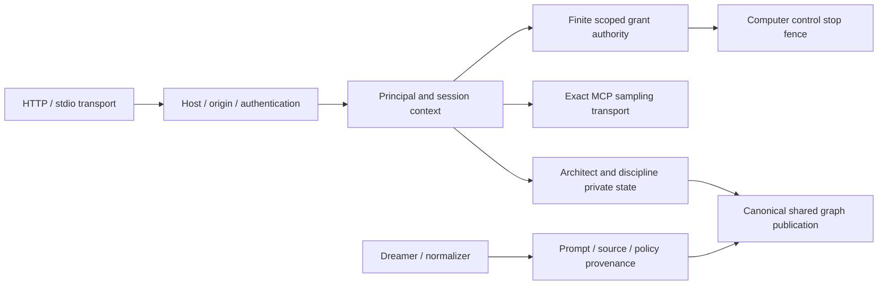

# DreamGraph Architecture

The [registered MCP contract](ashoka/mcp-contract.md) owns 93 core tools, 31 resource URIs and their shared schema/effect/result boundary. `src/server/core-catalog.ts` collects the actual registrars; `tool-policy.ts` and `tool-boundary.ts` enforce common policy before SDK argument normalization. `src/cli/utils/mcp-session.ts` owns persistent pass connections and bounded discovery; `src/utils/mcp-result.ts` preserves complete machine results separately from previews. Generated JSON/SDK artifacts are checked against registration, and authenticated `/api/contracts/v1/mcp` exposes the instance catalogue. Plugin and local support contributions are explicitly separate.

Version: **13.4.0**

Ashoka editor integration preserves whole MCP owner results in the agent loop, including receipts after errors and in older history. The shared native request serializer has an independent 8 MiB UTF-8 ceiling before dispatch, separate from token estimates and future complete spend admission. See [client integration](ashoka/client-integration.md) for actual qualification and remaining gates.

Slice25's `src/server/host-model-admission.ts` joins native hosts to the existing `ModelExecution`/`ModelAdmission` owners. Original authenticated host controls reserve a complete request before native dispatch and report usage/termination separately; workers cannot issue permits. Five additive generated host contracts are under qualification. No new persisted store, model substitution, pricing allocation or credential persistence is introduced; native API/CLI client adoption remains open.

Browser Architect's compact `src/architect/execution-review-ui.ts` panel renders literal exact actions from the original-host queue, captures their receipt/revision identity, and issues approve-once or decline controls. Unconfirmed approval acknowledgements retain the same request and pause continuation. Native API Stop is now advertised alongside CLI Stop; cancellation remains an uncertainty boundary. Eighteen composed Windows Chrome checks qualify the compiled shell with declared authority/executor doubles; actual HTTP/core checks qualify the separate authority boundary. Complete GE/UX/client coverage remains open.
License: **DreamGraph Source-Available Community License v2.0**

## Overview

C14 plan lifecycle is owned by `src/discipline/plan-workflow.ts` and `plan-authority.ts`, with generation/content-bound discipline approval in `approval.ts`. The existing registered `plan_state.json` metadata store shares the publication journal; see the [implementation contract and current limits](ashoka/plan-authority.md). Consumer adoption is underway.

Hosted model configuration supports GPT-6.1 Sol, GPT-6 Astra/Sol/Luna, GPT-5.6, and Claude Opus/Sonnet 5.5 and Fable/Mythos 5.1. OpenAI GPT-5.5/5.6/6 requests use Responses; Claude requests omit unsupported sampling parameters. Native tool loops retain provider assistant blocks for reasoning replay. Architect compaction can invalidate newer Claude thinking prefixes, so those models use the API's `drop_block` binding policy with count-only diagnostics. Model selections are configured independently for engine roles and Architect; see [LLM setup](setup-llm.md).

DreamGraph is an instance-scoped, graph-first cognitive daemon for development environments. Its primary architectural rule is that the knowledge graph is authoritative: features, workflows, data models, ADRs, UI elements, and tensions represent the system at a higher semantic level than any individual source file.

Core architectural surfaces:

- **Daemon runtime** — serves MCP tools, dashboard routes, orchestration, and cognitive workflows
- **Instance subsystem** — isolates projects and runtime state by UUID-scoped instance boundaries
- **Knowledge graph** — captures system structure, behavior, decisions, and unresolved tensions
- **Adaptive Future Engine** — ranks compliant candidate futures with evidence-bounded scoring and compact audit trails
- **CLI (`dg`)** — lifecycle management, status, scanning, and operational commands
- **VS Code extension** — dashboard embedding, chat UX, daemon/MCP client integration, changed-files UX


## Adaptive Future Engine

The Adaptive Future Engine is the v11 advisory preference layer. It compares compliant candidate futures after higher-authority constraints have already been applied: accepted ADRs, workflow/lifecycle rules, API and data-model contracts, graph evidence, and current user intent.

Architecturally it provides:

- deterministic task-class inference for planning-doc, adapter, graph-tool, and cognitive-workflow changes;
- future-fit score factors for evidence coverage, governance compatibility, workflow alignment, blast radius, reversibility, and fallback confidence;
- compact objections for rejected candidates;
- audit metadata that records selected/rejected candidate IDs, score factors, anchors, route/fallback provenance, and validation failures without storing raw prompts or full model responses.

The engine is not an enforcement subsystem and does not add a cognitive lifecycle state. Its output remains advisory and must degrade to deterministic fallback behavior when evidence is insufficient.

## Instance Model

Each DreamGraph instance has its own root directory under the master directory (typically `~/.dreamgraph/<uuid>/`). The instance stores:

- `instance.json` — identity and lifecycle metadata
- `config/` — instance config such as policies and MCP repository bindings
- `data/` — graph and cognitive JSON state
- `runtime/` — locks, temp files, and transient runtime state
- `logs/` — daemon and subsystem logs
- `exports/` — generated outputs and snapshots

The instance scope enforces project and repository boundaries. Repository bindings are security-relevant because they expand the set of filesystem paths considered in-bounds.

## Runtime Surfaces

### Daemon
The daemon hosts:
- MCP tools
- dashboard HTTP routes
- orchestration routes
- cognitive scheduling and dream-cycle execution
- project/graph scanning and enrichment

### CLI
The `dg` CLI is responsible for:
- creating and starting instances
- showing status and daemon metadata
- scanning and operational commands
- user-facing control flow for local installations

### VS Code Extension
The native editor execution owner is `extensions/vscode/src/managed-native-pass.ts`, with worker-bound MCP and daemon-owned command effects under qualification. The editor review owners are `extensions/vscode/src/execution-review.ts` and `extensions/vscode/src/webview/execution-review.ts`; captured exact proposals and acknowledgement recovery are currently under qualification.

The extension integrates DreamGraph into the editor and currently lives under `extensions/vscode/src/`. It surfaces the chat panel, dashboard, the Explorer (interactive graph with curated tension/candidate mutations — selectable 2D Sigma.js view or 3D Three.js view), and changed-files view. The Explorer SPA itself lives under `explorer/src/` and is bundled to `dist/explorer-spa/`, served by the daemon at `/explorer/`.

Explorer's glass rendering uses instanced type-specific geometries and bounded, tinted reflections. `TubeSystem` caps tube radii in screen space and reduces opacity near crowded hubs; normal alpha compositing prevents additive white hotspots. The 3D composer keeps a linear half-float target through bloom, then applies `OutputPass` tone mapping and sRGB conversion before SMAA. Sigma's custom shaders emit premultiplied colors for its blend mode. Both canvases use `label-layout.ts` to prioritize selection, reject overlapping labels, and cap visible labels by viewport area (maximum 18). The 3D label overlay only allocates DOM elements for accepted labels. Filters and two-hop Focus apply to both renderers.

For frontend development against an existing daemon, set `DREAMGRAPH_EXPLORER_PROXY` to its HTTP origin and run `npm --prefix explorer run dev`. Vite proxies Explorer API and event-stream requests to that origin; the default remains `http://localhost:8010`. This allows visual verification without restarting a daemon that is scanning.

### Copilot CLI Inheritance Proxy

When the Architect provider is set to `copilot-cli`, the extension spawns the GitHub Copilot CLI as a sub-process and must hand it an MCP server named `dreamgraph` so the CLI can reach the same knowledge graph and guarded host support surface the Architect is reading. Naively spawning a fresh `dreamgraph --transport stdio` child here would be wrong: it bypasses the extension's instance/session scoping, doubles store contention, and hides daemon-reachability failures from the user.

Instead, the extension ships a bundled **inheritance proxy** at `dist/copilot-cli-bridge.js`. The proxy:

1. Acts as a **stdio MCP server** toward Copilot CLI (this is what `mcp-config.json` points at).
2. Opens a **Streamable HTTP MCP client** to the architect's already-running daemon at `<baseUrl>/mcp` (URL is injected via `DREAMGRAPH_HOST_MCP_URL`).
3. Forwards upstream DreamGraph `resources/*` and `prompts/*` requests verbatim, and forwards upstream `tools/list` / `tools/call` while adding `run_command`, delegated to the daemon's governed command port. Managed turns bind the same ephemeral execution worker to probing and forwarding.
4. Requires the minimum graph/source grounding tools while exposing the live audited catalogue. Copilot native shell/write surfaces are denied; commands and source edits use the daemon authority. A task description cannot enable a provider-local effect. Separately granted native Computer Use remains a later qualification gate.
5. Appends paired running/terminal NDJSON records per `tools/call` to `DREAMGRAPH_AUDIT_PATH` or `<DREAMGRAPH_BRIDGE_AUDIT_DIR>/<DREAMGRAPH_RUN_ID>.ndjson` (server, tool, input, result, status, correlation, duration, byte counts and hashes). Completed-call readers exclude pending intent; an unsettled or unavailable audit retains recovery and fails honestly. Preview clipping is a declared byte safety ceiling and never changes the literal MCP result.
6. **Fails closed before MCP initialize completes** if the upstream cannot be reached or its `tools/list` health probe times out (exit 3, clear stderr) — the orchestrator's `mcp_servers_loaded` failure path then aborts the run instead of letting the model execute against a missing graph.

Canonical bridge source: `src/architect/cli-mcp-bridge.ts`, bundled into the extension's standalone `dist/copilot-cli-bridge.js`. Historical extension `bridge-entry.ts` is no longer the shipped owner. `managed-cli-pass.ts` admits a whole canonical prompt before the selected native CLI launches and retains durable closure. Tests: `extensions/vscode/src/test/copilot-cli-bridge-audit.test.ts`, `tests/host-managed-execution.test.ts`.

### Codex CLI Native Adapter

The `codex-cli` Architect provider is implemented as a native adapter that follows the accepted Copilot CLI adapter architecture while keeping Codex-specific invocation, sandbox, approval, help-surface, TOML config, runner, prompt serialization, provider-port projection, event parsing, and host-process handling in its own adapter directory. Authoritative Codex runs are pinned to `codex exec --json --sandbox read-only` and receive prompts through stdin using the positional `-` argument; when the installed `codex exec` help surface advertises `--ask-for-approval`, the adapter also emits `--ask-for-approval never`. DreamGraph MCP remains the only authoritative route for repository grounding, mutation, and verification. The runner validates `codex login status` before non-interactive execution and preserves clickable `codex login` recovery metadata for unauthenticated failures. If the exec transcript reports MCP runtime failures but the bridge audit contains no DreamGraph MCP calls, the runner fails closed with `MCP_PROBE_FAILED` instead of accepting ungrounded provider-inline output without a trace. The provider is selectable through Architect settings/model routing, covers user turns and autonomy continuations, streams live DreamGraph MCP tool progress from the shared audit NDJSON bridge, projects Codex `item.completed` / `agent_message` events into final assistant text while routing non-JSON process output to diagnostics, reconciles final authoritative tool traces without duplicates, and keeps changed-file review reconciliation independent from provider-port tool projection while preserving Copilot CLI behavior.

Path: `extensions/vscode/src/architect-core/adapters/codex-cli/`. Chat integration: `extensions/vscode/src/chat-panel.ts`, `extensions/vscode/src/architect-llm.ts`, `extensions/vscode/package.json`. Tests: `extensions/vscode/src/test/codex-cli-adapter.test.ts`, `extensions/vscode/src/test/codex-cli-orchestrator.test.ts`, `extensions/vscode/src/test/codex-cli-provider-port.test.ts`, `extensions/vscode/src/test/slice5-audit.test.ts`.

Release note: `codex-cli` native Architect adapter support is covered by ADR-201 native-adapter constraints. No new ADR is required because the implementation reuses the accepted native CLI adapter pattern and only adds Codex-specific execution/configuration mechanics behind the adapter boundary.

## Source Layout

This section is generated from the repository source tree. It should list all current files under the primary source roots.

```text
src/
  src/api/routes.ts
  src/architect/cli-bridge.ts
  src/architect/cli-mcp-bridge.ts
  src/architect/computer-use-ui.ts
  src/architect/context-actions.ts
  src/architect/continuation.ts
  src/architect/desire-ledger.ts
  src/architect/execution-review-ui.ts
  src/architect/native-tool-loop.ts
  src/architect/onboarding-readiness.ts
  src/architect/onboarding-telemetry.ts
  src/architect/plan-registry.ts
  src/architect/pulse.ts
  src/architect/repo-setup.ts
  src/architect/routes.ts
  src/architect/timeout-hierarchy.ts
  src/architect/token-economy/standalone-store.ts
  src/architect/tool-selection.ts
  src/architect/verbosity.ts
  src/cli/commands/architect.ts
  src/cli/commands/attach.ts
  src/cli/commands/bootstrap.ts
  src/cli/commands/computer-use.ts
  src/cli/commands/curate.ts
  src/cli/commands/enrich.ts
  src/cli/commands/export.ts
  src/cli/commands/fork.ts
  src/cli/commands/graph-upgrade.ts
  src/cli/commands/init.ts
  src/cli/commands/instances.ts
  src/cli/commands/lifecycle-ops.ts
  src/cli/commands/migrate.ts
  src/cli/commands/plugin.ts
  src/cli/commands/restart.ts
  src/cli/commands/scan.ts
  src/cli/commands/schedule.ts
  src/cli/commands/start.ts
  src/cli/commands/status.ts
  src/cli/commands/stop.ts
  src/cli/commands/webhook.ts
  src/cli/dg.ts
  src/cli/utils/architect-client.ts
  src/cli/utils/daemon.ts
  src/cli/utils/mcp-call.ts
  src/cli/utils/mcp-session.ts
  src/cli/version.ts
  src/cognitive/adaptive-future-scaffold.ts
  src/cognitive/adversarial.ts
  src/cognitive/bootstrap-driver.ts
  src/cognitive/bootstrap-registry.ts
  src/cognitive/calibration-evaluation.ts
  src/cognitive/causal.ts
  src/cognitive/cognitive-provenance.ts
  src/cognitive/cognitive-store.ts
  src/cognitive/curation.ts
  src/cognitive/digestion.ts
  src/cognitive/dream-deduplication.ts
  src/cognitive/dreamer.ts
  src/cognitive/engine.ts
  src/cognitive/event-router.ts
  src/cognitive/evidence-ledger.ts
  src/cognitive/federation.ts
  src/cognitive/graph-maintenance-state.ts
  src/cognitive/graph-paths.ts
  src/cognitive/graph-rag.ts
  src/cognitive/intervention.ts
  src/cognitive/job-context.ts
  src/cognitive/jobs.ts
  src/cognitive/lifecycle-visibility.ts
  src/cognitive/llm-readiness.ts
  src/cognitive/llm.ts
  src/cognitive/lucid.ts
  src/cognitive/metacognition.ts
  src/cognitive/model-admission.ts
  src/cognitive/model-execution.ts
  src/cognitive/narrator.ts
  src/cognitive/normalization-evidence.ts
  src/cognitive/normalization-publication.ts
  src/cognitive/normalization-results.ts
  src/cognitive/normalizer.ts
  src/cognitive/playback.ts
  src/cognitive/projection-context.ts
  src/cognitive/provider-images.ts
  src/cognitive/provider-outcome.ts
  src/cognitive/provider-usage.ts
  src/cognitive/register.ts
  src/cognitive/risk-lifecycle.ts
  src/cognitive/role-instructions.ts
  src/cognitive/role-qualification.ts
  src/cognitive/schedule-definition.ts
  src/cognitive/scheduler.ts
  src/cognitive/strategies/_shared.ts
  src/cognitive/strategies/cross-domain-bridging.ts
  src/cognitive/strategies/gap-detection.ts
  src/cognitive/strategies/llm-dream.ts
  src/cognitive/strategies/missing-abstraction.ts
  src/cognitive/strategies/orphan-bridging.ts
  src/cognitive/strategies/pgo-wave.ts
  src/cognitive/strategies/schema-grounding.ts
  src/cognitive/strategies/symmetry-completion.ts
  src/cognitive/strategies/tension-directed.ts
  src/cognitive/strategies/weak-reinforcement.ts
  src/cognitive/strategy-catalog.ts
  src/cognitive/strategy-portfolio.ts
  src/cognitive/strategy-registry.ts
  src/cognitive/targeted-dreams.ts
  src/cognitive/temporal-evidence.ts
  src/cognitive/temporal.ts
  src/cognitive/tension-clustering.ts
  src/cognitive/trust-state.ts
  src/cognitive/types.ts
  src/computer/broker.ts
  src/computer/browser-driver.ts
  src/computer/browser-harness.ts
  src/computer/browser-profile.ts
  src/computer/browser-registry.ts
  src/computer/browser-worker-entry.ts
  src/computer/capabilities.ts
  src/computer/configuration.ts
  src/computer/digest.ts
  src/computer/http.ts
  src/computer/journal-schema.ts
  src/computer/journal.ts
  src/computer/native-pass-schema.ts
  src/computer/native-tools.ts
  src/computer/physical-seat.ts
  src/computer/qualify-browser.ts
  src/computer/worker-port.ts
  src/config/config.ts
  src/config/engine-configuration.ts
  src/config/engine-env-document.ts
  src/config/engine-setting-catalogue.ts
  src/config/engine-settings.ts
  src/config/model-pricing.ts
  src/config/model-temperature.ts
  src/config/provider-capabilities.ts
  src/config/role-env-fields.ts
  src/config/role-policy.ts
  src/config/role-settings.ts
  src/config/setting-schema.ts
  src/discipline/approval.ts
  src/discipline/artifacts.ts
  src/discipline/manifest.ts
  src/discipline/plan-authority.ts
  src/discipline/plan-runtime.ts
  src/discipline/plan-workflow.ts
  src/discipline/prompts.ts
  src/discipline/protection.ts
  src/discipline/register.ts
  src/discipline/session.ts
  src/discipline/state-machine.ts
  src/discipline/tool-proxy.ts
  src/discipline/tools.ts
  src/discipline/types.ts
  src/evaluation/agent-usefulness.ts
  src/evaluation/cognitive-policy.ts
  src/explorer/audit.ts
  src/explorer/auth.ts
  src/explorer/events.ts
  src/explorer/heatmap.ts
  src/explorer/mutations.ts
  src/explorer/prefs.ts
  src/explorer/queries.ts
  src/explorer/reason-suggest.ts
  src/explorer/routes.ts
  src/explorer/static.ts
  src/graph/change-obligations.ts
  src/graph/context-pack.ts
  src/graph/contracts.ts
  src/graph/events.ts
  src/graph/execution-context.ts
  src/graph/legacy-upgrade.ts
  src/graph/metrics.ts
  src/graph/observed-command.ts
  src/graph/projection-comparison.ts
  src/graph/publication.ts
  src/graph/read-model.ts
  src/graph/retrieval-index.ts
  src/graph/snapshot.ts
  src/graph/store-registry.ts
  src/graph/store.ts
  src/graph/upgrade-notice.ts
  src/graph/watcher.ts
  src/graph/writer-lease.ts
  src/index.ts
  src/instance/bootstrap.ts
  src/instance/cli.ts
  src/instance/datastore-bootstrap.ts
  src/instance/identity.ts
  src/instance/index.ts
  src/instance/lifecycle.ts
  src/instance/policies.ts
  src/instance/registry.ts
  src/instance/scope.ts
  src/instance/types.ts
  src/observability/analytics-snapshot.ts
  src/observability/runtime-metrics.ts
  src/plugins/architect-contributions.ts
  src/plugins/architect-plan-state.ts
  src/plugins/closure-stores.ts
  src/plugins/contributions.ts
  src/plugins/graph-context.ts
  src/plugins/manager.ts
  src/resources/register.ts
  src/resources/resolver.ts
  src/scanner/extractors/c.ts
  src/scanner/extractors/cpp.ts
  src/scanner/extractors/csharp.ts
  src/scanner/extractors/go.ts
  src/scanner/extractors/gradle.ts
  src/scanner/extractors/java.ts
  src/scanner/extractors/kotlin.ts
  src/scanner/extractors/python.ts
  src/scanner/extractors/rust.ts
  src/scanner/extractors/swift.ts
  src/scanner/ontology.ts
  src/scanner/orchestrator.ts
  src/scanner/parser-bootstrap.ts
  src/scanner/types.ts
  src/semantic-invariants.ts
  src/server/computer-control.ts
  src/server/configuration-workspace.ts
  src/server/context-menu.ts
  src/server/core-catalog.ts
  src/server/dashboard.ts
  src/server/execution-policy.ts
  src/server/host-model-admission.ts
  src/server/http-authority.ts
  src/server/http-policy.ts
  src/server/managed-execution.ts
  src/server/runtime-workspace.ts
  src/server/schedule-api.ts
  src/server/schedule-workspace-contract.ts
  src/server/schedule-workspace.ts
  src/server/scoped-command.ts
  src/server/server.ts
  src/server/session-authority.ts
  src/server/session-context.ts
  src/server/tool-boundary.ts
  src/server/tool-policy.ts
  src/tools/adr-historian.ts
  src/tools/api-surface.ts
  src/tools/auxiliary-classifier.ts
  src/tools/auxiliary-generators.ts
  src/tools/auxiliary-store.ts
  src/tools/bootstrap-instance.ts
  src/tools/code-senses.ts
  src/tools/coverage-ledger.ts
  src/tools/db-senses.ts
  src/tools/enrich-parser-nodes.ts
  src/tools/enrich-seed-data.ts
  src/tools/enrichment-publication.ts
  src/tools/enrichment-state.ts
  src/tools/get-workflow.ts
  src/tools/git-senses.ts
  src/tools/graph-edge-mutations.ts
  src/tools/graph-health.ts
  src/tools/graph-integrity.ts
  src/tools/incremental-reconciliation.ts
  src/tools/init-graph.ts
  src/tools/living-docs-exporter.ts
  src/tools/native-data-model.ts
  src/tools/native-ui-scanner.ts
  src/tools/plugin-ops.ts
  src/tools/query-resource.ts
  src/tools/reconciliation-transaction.ts
  src/tools/register.ts
  src/tools/runtime-senses.ts
  src/tools/sanitize-entity.ts
  src/tools/scan-project.ts
  src/tools/scan-state.ts
  src/tools/scan-types.ts
  src/tools/scanner-artifact-policy.ts
  src/tools/search-data-model.ts
  src/tools/solidify-insight.ts
  src/tools/structural-generators.ts
  src/tools/ui-registry.ts
  src/tools/visual-architect.ts
  src/tools/web-senses.ts
  src/tools/webhooks.ts
  src/tools/wire-links.ts
  src/types/index.ts
  src/utils/atomic-write.ts
  src/utils/cache.ts
  src/utils/engine-env.ts
  src/utils/enrichment-context.ts
  src/utils/errors.ts
  src/utils/graph-operation.ts
  src/utils/graph-reconciliation-barrier.ts
  src/utils/json-store.ts
  src/utils/logger.ts
  src/utils/mcp-result.ts
  src/utils/metrics.ts
  src/utils/mutex.ts
  src/utils/paths.ts
  src/utils/read-json.ts
  src/utils/senses.ts
  src/utils/tool-output.ts
  src/utils/ui-index.ts
  src/webhooks/sign.ts
  src/webhooks/store.ts
  src/webhooks/worker.ts
extensions/vscode/src/
  extensions/vscode/src/architect-core/adapters/clock.ts
  extensions/vscode/src/architect-core/adapters/codex-cli/allowlist.ts
  extensions/vscode/src/architect-core/adapters/codex-cli/argv.ts
  extensions/vscode/src/architect-core/adapters/codex-cli/event-stream.ts
  extensions/vscode/src/architect-core/adapters/codex-cli/help-probe.ts
  extensions/vscode/src/architect-core/adapters/codex-cli/host/clock-adapter.ts
  extensions/vscode/src/architect-core/adapters/codex-cli/host/crypto-adapter.ts
  extensions/vscode/src/architect-core/adapters/codex-cli/host/fs-adapter.ts
  extensions/vscode/src/architect-core/adapters/codex-cli/host/index.ts
  extensions/vscode/src/architect-core/adapters/codex-cli/host/process-adapter.ts
  extensions/vscode/src/architect-core/adapters/codex-cli/index.ts
  extensions/vscode/src/architect-core/adapters/codex-cli/mcp-config.ts
  extensions/vscode/src/architect-core/adapters/codex-cli/orchestrator-ports.ts
  extensions/vscode/src/architect-core/adapters/codex-cli/orchestrator.ts
  extensions/vscode/src/architect-core/adapters/codex-cli/prompt-serializer.ts
  extensions/vscode/src/architect-core/adapters/codex-cli/provider-port.ts
  extensions/vscode/src/architect-core/adapters/codex-cli/transcript-classifier.ts
  extensions/vscode/src/architect-core/adapters/codex-cli/transcript.ts
  extensions/vscode/src/architect-core/adapters/codex-cli/types.ts
  extensions/vscode/src/architect-core/adapters/copilot-cli/allowlist.ts
  extensions/vscode/src/architect-core/adapters/copilot-cli/argv.ts
  extensions/vscode/src/architect-core/adapters/copilot-cli/event-stream.ts
  extensions/vscode/src/architect-core/adapters/copilot-cli/help-probe.ts
  extensions/vscode/src/architect-core/adapters/copilot-cli/host/audit-adapter.ts
  extensions/vscode/src/architect-core/adapters/copilot-cli/host/audit-live-adapter.ts
  extensions/vscode/src/architect-core/adapters/copilot-cli/host/bridge-entry.ts
  extensions/vscode/src/architect-core/adapters/copilot-cli/host/clock-adapter.ts
  extensions/vscode/src/architect-core/adapters/copilot-cli/host/crypto-adapter.ts
  extensions/vscode/src/architect-core/adapters/copilot-cli/host/fs-adapter.ts
  extensions/vscode/src/architect-core/adapters/copilot-cli/host/index.ts
  extensions/vscode/src/architect-core/adapters/copilot-cli/host/process-adapter.ts
  extensions/vscode/src/architect-core/adapters/copilot-cli/host/registry-adapter.ts
  extensions/vscode/src/architect-core/adapters/copilot-cli/index.ts
  extensions/vscode/src/architect-core/adapters/copilot-cli/mcp-config.ts
  extensions/vscode/src/architect-core/adapters/copilot-cli/orchestrator-ports.ts
  extensions/vscode/src/architect-core/adapters/copilot-cli/orchestrator.ts
  extensions/vscode/src/architect-core/adapters/copilot-cli/prompt-serializer.ts
  extensions/vscode/src/architect-core/adapters/copilot-cli/provider-port.ts
  extensions/vscode/src/architect-core/adapters/copilot-cli/transcript-classifier.ts
  extensions/vscode/src/architect-core/adapters/copilot-cli/transcript.ts
  extensions/vscode/src/architect-core/adapters/copilot-cli/types.ts
  extensions/vscode/src/architect-core/adapters/host.ts
  extensions/vscode/src/architect-core/adapters/v1.ts
  extensions/vscode/src/architect-core/index.ts
  extensions/vscode/src/architect-core/pass.ts
  extensions/vscode/src/architect-core/ports.ts
  extensions/vscode/src/architect-core/runner.ts
  extensions/vscode/src/architect-core/types.ts
  extensions/vscode/src/architect-lens.ts
  extensions/vscode/src/architect-llm.ts
  extensions/vscode/src/architect-pass-projection.ts
  extensions/vscode/src/architect-pass-schema.ts
  extensions/vscode/src/autonomy-contract.ts
  extensions/vscode/src/autonomy-loop.ts
  extensions/vscode/src/autonomy-structured.ts
  extensions/vscode/src/autonomy.ts
  extensions/vscode/src/budget-coordinator-reader.ts
  extensions/vscode/src/budget-coordinator.ts
  extensions/vscode/src/change-review-service.ts
  extensions/vscode/src/changed-files-view.ts
  extensions/vscode/src/chat-memory.ts
  extensions/vscode/src/chat-panel/helpers.ts
  extensions/vscode/src/chat-panel/timeout.ts
  extensions/vscode/src/chat-panel.ts
  extensions/vscode/src/chat-panel.ts.good
  extensions/vscode/src/command-runner.ts
  extensions/vscode/src/commands.ts
  extensions/vscode/src/computer-control.ts
  extensions/vscode/src/computer-pass.ts
  extensions/vscode/src/context-builder.instrumentation.ts
  extensions/vscode/src/context-builder.ts
  extensions/vscode/src/context-cache.ts
  extensions/vscode/src/context-fetchers/deep-insights.ts
  extensions/vscode/src/context-inspector.ts
  extensions/vscode/src/daemon-client.ts
  extensions/vscode/src/dashboard-view.ts
  extensions/vscode/src/envelope-utils.ts
  extensions/vscode/src/environment-context.ts
  extensions/vscode/src/execution-review.ts
  extensions/vscode/src/extension.ts
  extensions/vscode/src/generated/computer-pass.ts
  extensions/vscode/src/generated/graph-contracts.ts
  extensions/vscode/src/generated/provider-capabilities.ts
  extensions/vscode/src/generated/provider-outcome.ts
  extensions/vscode/src/graph-signal.ts
  extensions/vscode/src/health-monitor.ts
  extensions/vscode/src/instance-resolver.ts
  extensions/vscode/src/intent-detector.ts
  extensions/vscode/src/local-tools.ts
  extensions/vscode/src/managed-cli-pass.ts
  extensions/vscode/src/managed-model-session.ts
  extensions/vscode/src/managed-native-pass.ts
  extensions/vscode/src/mcp-client.ts
  extensions/vscode/src/openai-responses-adapter.ts
  extensions/vscode/src/prompts/architect-core.ts
  extensions/vscode/src/prompts/architect-explain.ts
  extensions/vscode/src/prompts/architect-patch.ts
  extensions/vscode/src/prompts/architect-suggest.ts
  extensions/vscode/src/prompts/architect-validate.ts
  extensions/vscode/src/prompts/index.ts
  extensions/vscode/src/reporting.ts
  extensions/vscode/src/request-compaction.ts
  extensions/vscode/src/reviewable-file-filter.ts
  extensions/vscode/src/status-bar.ts
  extensions/vscode/src/task-reporter.ts
  extensions/vscode/src/test/action-card-renderer.test.ts
  extensions/vscode/src/test/adaptive-future-inspector.test.ts
  extensions/vscode/src/test/agent-tool-result-handoff.test.ts
  extensions/vscode/src/test/anthropic-fable-mythos.test.ts
  extensions/vscode/src/test/architect-core-pass.test.ts
  extensions/vscode/src/test/architect-lens.test.ts
  extensions/vscode/src/test/architect-v2-isolation.test.ts
  extensions/vscode/src/test/autonomy-actions.test.ts
  extensions/vscode/src/test/autonomy-budget-exhaustion.test.ts
  extensions/vscode/src/test/autonomy-contract.test.ts
  extensions/vscode/src/test/autonomy-loop.test.ts
  extensions/vscode/src/test/autonomy-mode-switches.test.ts
  extensions/vscode/src/test/autonomy-prompt.test.ts
  extensions/vscode/src/test/autonomy-reporting.test.ts
  extensions/vscode/src/test/autonomy-structured.test.ts
  extensions/vscode/src/test/autonomy-token-economy.test.ts
  extensions/vscode/src/test/autonomy.test.ts
  extensions/vscode/src/test/budget-coordinator.test.ts
  extensions/vscode/src/test/canonical-context-builder.test.ts
  extensions/vscode/src/test/card-renderer.test.ts
  extensions/vscode/src/test/chat-memory.test.ts
  extensions/vscode/src/test/chat-panel-copilot-cli-diff.test.ts
  extensions/vscode/src/test/chat-panel-helpers.test.ts
  extensions/vscode/src/test/codex-cli-adapter.test.ts
  extensions/vscode/src/test/codex-cli-orchestrator.test.ts
  extensions/vscode/src/test/codex-cli-provider-port.test.ts
  extensions/vscode/src/test/computer-control.test.ts
  extensions/vscode/src/test/computer-pass.test.ts
  extensions/vscode/src/test/context-architecture-contract.test.ts
  extensions/vscode/src/test/context-builder-environment.test.ts
  extensions/vscode/src/test/context-builder-integration.test.ts
  extensions/vscode/src/test/context-builder-pressure.test.ts
  extensions/vscode/src/test/context-cache-invalidation.test.ts
  extensions/vscode/src/test/context-cache-timeout-truncation.test.ts
  extensions/vscode/src/test/context-output-logging.test.ts
  extensions/vscode/src/test/copilot-cli-adapter.test.ts
  extensions/vscode/src/test/copilot-cli-audit-live.test.ts
  extensions/vscode/src/test/copilot-cli-bridge-audit.test.ts
  extensions/vscode/src/test/copilot-cli-event-stream.test.ts
  extensions/vscode/src/test/copilot-cli-host-adapters.test.ts
  extensions/vscode/src/test/copilot-cli-orchestrator.test.ts
  extensions/vscode/src/test/copilot-cli-prompt-serializer.test.ts
  extensions/vscode/src/test/copilot-cli-provider-port.test.ts
  extensions/vscode/src/test/daemon-computer-control.test.ts
  extensions/vscode/src/test/entity-links.test.ts
  extensions/vscode/src/test/envelope-loose.test.ts
  extensions/vscode/src/test/environment-context.test.ts
  extensions/vscode/src/test/latest-model-requests.test.ts
  extensions/vscode/src/test/openai-responses-adapter.test.ts
  extensions/vscode/src/test/render-markdown.test.ts
  extensions/vscode/src/test/slice4-redaction.test.ts
  extensions/vscode/src/test/slice4-ui.test.ts
  extensions/vscode/src/test/slice4-verify.test.ts
  extensions/vscode/src/test/slice5-actions.test.ts
  extensions/vscode/src/test/slice5-audit.test.ts
  extensions/vscode/src/test/slice5-next-pass.test.ts
  extensions/vscode/src/test/slice5-runtime.test.ts
  extensions/vscode/src/test/slice5-ui.test.ts
  extensions/vscode/src/test/timeout-diagnostics.test.ts
  extensions/vscode/src/test/timeout-recovery.test.ts
  extensions/vscode/src/test/tool-classification.test.ts
  extensions/vscode/src/test/tool-groups-primed.test.ts
  extensions/vscode/src/test/tool-result-compression.test.ts
  extensions/vscode/src/test/webview-bundle.test.ts
  extensions/vscode/src/tool-classification.ts
  extensions/vscode/src/tool-groups.ts
  extensions/vscode/src/tool-result-compression.ts
  extensions/vscode/src/types.ts
  extensions/vscode/src/version.ts
  extensions/vscode/src/webview/card-renderer.ts
  extensions/vscode/src/webview/computer-control.ts
  extensions/vscode/src/webview/computer-pass.ts
  extensions/vscode/src/webview/entity-links.ts
  extensions/vscode/src/webview/execution-review.ts
  extensions/vscode/src/webview/index.ts
  extensions/vscode/src/webview/protocol.ts
  extensions/vscode/src/webview/render-markdown.ts
  extensions/vscode/src/webview/styles.ts
scripts/
  scripts/_codeql_scan.cjs
  scripts/_codeql_scan.js
  scripts/_fix_alert3.cjs
  scripts/_fix_codeql.cjs
  scripts/_grep_out.txt
  scripts/_grep.cjs
  scripts/_grep2.cjs
  scripts/_insights_out.json
  scripts/_mcp_call.cjs
  scripts/_mcp_init.json
  scripts/_mcp_insights.json
  scripts/_mcp_result.json
  scripts/_mcp_root.txt
  scripts/add-backlinks.mjs
  scripts/ashoka-ci-browser.mjs
  scripts/audit-nodes.mjs
  scripts/audit-orphans.mjs
  scripts/benchmark-architect-navigation.mjs
  scripts/benchmark-retrieval.mjs
  scripts/benchmark-scan-mcp.mjs
  scripts/benchmark-token-economy.mjs
  scripts/build-plugin-docs.ps1
  scripts/collect-agent-pair.mjs
  scripts/enrich-graph.mjs
  scripts/evaluate-cognitive-policies.mjs
  scripts/export-analytics-snapshot.mjs
  scripts/freeze-ashoka-baseline.mjs
  scripts/generate-architecture-tree.mjs
  scripts/generate-configuration-inventory.mjs
  scripts/generate-easy-start-docs.mjs
  scripts/generate-graph-contracts.mjs
  scripts/generate-mcp-catalog.mjs
  scripts/generate-metric-definitions.mjs
  scripts/generate-primary-workflow-docs.mjs
  scripts/generate-provider-contracts.mjs
  scripts/install.ps1
  scripts/install.sh
  scripts/mcp-call.mjs
  scripts/probe-hello-events.mjs
  scripts/qualify-ashoka-architect.mjs
  scripts/qualify-ashoka-codex-computer-policy.mjs
  scripts/qualify-ashoka-configuration.mjs
  scripts/qualify-ashoka-editor-operator.mjs
  scripts/qualify-ashoka-editor-review.mjs
  scripts/qualify-ashoka-integration-evidence.mjs
  scripts/qualify-ashoka-native-review.mjs
  scripts/qualify-ashoka-navigation.mjs
  scripts/qualify-ashoka-plan-consumers.mjs
  scripts/qualify-ashoka-surfaces.mjs
  scripts/qualify-ashoka-wsl-browser.mjs
  scripts/record-adr-v9-release.mjs
  scripts/record-ashoka-clock-evidence.mjs
  scripts/record-ashoka-computer-evidence.mjs
  scripts/record-ashoka-editor-computer-evidence.mjs
  scripts/record-ashoka-editor-evidence.mjs
  scripts/record-ashoka-health-evidence.mjs
  scripts/record-ashoka-migration-evidence.mjs
  scripts/record-ashoka-native-cli-evidence.mjs
  scripts/record-ashoka-native-pass-evidence.mjs
  scripts/record-ashoka-provider-output-evidence.mjs
  scripts/record-ashoka-recovery-evidence.mjs
  scripts/record-ashoka-wsl-evidence.mjs
  scripts/repair-confidence-inflation.mjs
  scripts/run-ashoka-editor-tests.mjs
  scripts/run-ashoka-system-checks.mjs
  scripts/stub-dangling.mjs
  scripts/validate-live-manifest.mjs
  scripts/webhook-test-receiver.mjs
  scripts/wire-links-cli.mjs
  scripts/workspace-artifacts.mjs
```

## Version Semantics

The CLI, standalone Architect, VS Code Architect, daemon, Explorer, Dashboard, analytics suite, and daemon-exposed MCP authority ship as release **13.4.0**. Daemon HTTP surfaces and MCP identity/resources read the root package version. Explorer reads its package metadata; VS Code MCP clients and CLI bridges use their matching release constants. Analytics reads root package metadata and exposes `--version` on the dispatcher and individual analyzers.

A DreamGraph installation may surface more than one version value:

- **Created With** — the version recorded in an instance identity file when the instance was created
- **Daemon Version** — the version reported by the currently running daemon binary
- **Package Version** — the repository/package version declared in `package.json`

These values can legitimately differ after upgrades or when an older instance continues to run under a newer daemon.

## Licensing

DreamGraph is distributed under the **DreamGraph Source-Available Community License v2.0**. It is source-available and should not be described as OSI-approved open source unless a specific edition is separately released under such a license.

See `LICENSE` for the authoritative license text.
<!-- CONTINUATION TEST SLICE 2 -->

### Ashoka provider boundaries

Slice25 [client integration](ashoka/client-integration.md) adds captured contextual targets, stable selected-plan reveal and canonical `/api/context/v1`. Generated VSCode contracts consume the core schema. `src/graph/execution-context.ts` publishes private bounded `execution_contexts.json` records through the existing journal; these are delivery/closure metadata, not graph proof. Both managed browser adapter routes use daemon execution credentials and the same command fence. Full execution-loop/other-client qualification remains pending. `packages/token-economy/src/machine-result.ts` preserves required machine anchors under whole-result omission.

Named provider capability evidence and role dispatch live in the existing configuration/cognitive owners. `provider-outcome.ts` validates completion/tool outcomes, original schemas and token semantics before acceptance. See [the implementation checkpoint](ashoka/providers.md); it does not qualify Computer Use or paid model evaluation.

### Ashoka configuration boundary

| Setting / surface | Authority and behavior |
|---|---|
| `DREAMGRAPH_SCHEDULER`, `DREAMGRAPH_EVENTS`, `DREAMGRAPH_NARRATIVE` | Shared complete-candidate schemas; persisted before hot application; legacy DG aliases have explicit precedence. |
| Role settings and budgets | Independent six-role policy; catalogue validation and redacted inspection; templates preserve paid allocations and secrets. |
| `DREAMGRAPH_COMPUTER_USE` | Disabled by default; bounded route settings only, never target/execution grants. |
| `/api/config/v1` | Revision CAS, payload-bound receipt replay, protected template preview/apply and revision-aware undo. |

See [configuration authority](ashoka/configuration.md) and [generated inventory](ashoka/configuration-inventory.json) for exact types, units, sources and apply semantics. Explicit deployment overrides outrank validated instance intent; restart-only changes remain visibly different from actual runtime. Config backups reside under the private config folder, not graph stores.

The [compact workspace](ashoka/configuration-workspace.md) exposes all catalogue settings, six effective roles, protected template diffs and exact saved/runtime readback. Model-only activation cannot alter scheduler/event/narrative ownership. Root/Status reuse canonical graph currency, dirty knowledge and scoped job pagination/cancellation; the root links Explorer and Architect. Slice 23 integration qualification is pending.

### Ashoka cognitive attribution and session boundary

`src/cognitive/cognitive-provenance.ts` hashes exact supplied context/prompt/schema and retains immutable route/admission provenance; `src/evaluation/cognitive-policy.ts` evaluates frozen source/ancestry labels without dispatching providers. `scripts/evaluate-cognitive-policies.mjs` preserves the unfavorable current structural-normalizer baseline as well as evaluator cases. [Qualification limits](ashoka/cognitive-policy-evaluation.md) remain explicit.

`src/server/session-context.ts` pins async identity/data scope. `session-authority.ts` persists private preferences/token hashes/finite double-confirmed grants. `http-policy.ts` validates `DREAMGRAPH_HTTP_BIND` (restart; default 127.0.0.1), `DREAMGRAPH_REMOTE_ENABLED` (restart; default false), `DREAMGRAPH_REMOTE_TOKEN` (protected secret), `DREAMGRAPH_HTTP_ALLOWED_HOSTS` and `DREAMGRAPH_HTTP_ALLOWED_ORIGINS` (exact JSON arrays). `http-authority.ts` gates every route/upgrade. `computer-control.ts` supplies owner/generation/fence and independently acknowledged stop ports. [Actual native/seat qualification remains later work](ashoka/session-authority.md).




`src/cognitive/normalization-evidence.ts` owns the registered `normalization_evidence.json` graph ledger and bounded internal source-proof publication port. It uses the canonical physical writer, CAS, journal and operation receipts; it is separate from semantic plausibility. See [claim evidence](ashoka/normalization-evidence.md).

`src/cognitive/normalization-publication.ts` owns coherent normalizer snapshots, typed claim resolution and one C04 promotion transaction. The old direct engine promotion methods reject bypasses; source/human/hypothesis semantics and history are preserved.

`src/server/execution-policy.ts` owns C13 finite exact-action admission and ephemeral execution credentials; `scoped-command.ts` moves bridge commands to the daemon fence. `normalization-results.ts` owns hash-bound complete normalization outcome recovery.

Ashoka Slice 14 [persistent strategy learning](ashoka/strategy-learning.md) stores post-dedup observations and reviewed usefulness in existing `meta_log.json`, with atomic dream/learning publication and explicit fixed-allocation recovery. Source owners include `src/cognitive/strategy-portfolio.ts` and `src/cognitive/dream-deduplication.ts`; repeated generation is neither evidence nor labeled accuracy. Qualification is pending.

Ashoka Slice 16 [curation and retention](ashoka/curation-retention.md) adds append-only dispositions to existing `graph_maintenance.json` and reversible hash-bound archives. The source owner is `src/cognitive/curation.ts`. Reject/retire/reopen, dream decay and quarantine share the graph publication writer; human acceptance remains a human assertion and assessment history is preserved. `mutate_validated_edge` now requires `reason` and `expected_revision` and accepts `operation_id`/`dry_run`; retarget creates a proposal requiring revalidation. Qualification is pending.

Cognitive operational store reads use `src/cognitive/cognitive-store.ts` and the canonical read barrier; missing/corrupt previously published history is unavailable, never an empty reset.

## Durable engine jobs (Slice 17, implementation in progress)

`src/cognitive/jobs.ts` owns the existing registered `jobs.json`; `job-context.ts` supplies the execution scope. The shared graph writer checks the generation fence before publication. Parent inference admission intersects immutable role allocations across child roles and fallbacks. Cancellation leaves uncertain effects and conflict ownership visible until acknowledgement or recovery. This is the execution authority beneath scheduler/event/bootstrap producers, not a second scheduler. Adoption and qualification are pending.

Slice 17 producer adoption: manual scan/enrichment and MCP cognitive actions enter the same job owner; scheduled occurrences link a frozen job before dispatch. `src/cognitive/schedule-definition.ts` is the shared evaluator; `src/cognitive/digestion.ts` owns bounded affected-region stages; `src/server/schedule-api.ts` exposes the core ports. Readiness records `pending_admission` and never starts a scan or re-enrichment. No new named store is added. Qualification and remaining cross-surface adoption are in progress.

Slice17 daemon startup recovers durable job ownership before dispatch; webhooks and bootstrap histories share verified publication. Outbound send intent/acknowledgement live in the existing jobs owner, with no second queue authority. Queued effects resume, uncertain effects stay fenced, and graceful shutdown persists cancellation before bounded drainage. See ashoka/engine-jobs.md.

Ashoka temporal-evidence.ts owns shared historical time/deduplication policy; temporal.ts and causal.ts project it. Tension publications include actual observations and stable correlation hypotheses. Federation v2 retains the existing archetype owner and publication authority; bounded dependency generations join the existing digestion system. See [time/foreign-origin rules](ashoka/temporal-federation.md).

DREAMGRAPH_FEDERATION is typed by FederationSettingsSchema and applies to the next execution. Template reset preserves its sharing policy and namespace; enabled unredacted export fails validation.
# Ashoka Explorer and schedule surfaces

Slice24 production Explorer v2 projects one canonical revision with typed identities/current assertion classes, bounded render scope and adjacency/context pages. `render_key` separates layout content from metadata-only revision updates. The shared RAG assembler produces its explicit agent-context view. See [Explorer contract](ashoka/explorer-evidence.md).

Slice29 `/schedules` consumes the existing scheduler/job authority through `schedule-api.ts` and `schedule-workspace-contract.ts`. The compact browser workflow adds disabled drafts, policy-bound previews, CAS edits, atomic duplicates, durable enqueue, separate pause/cancel and immutable history. Legacy form POST is retired with 410. See [workspace contract](ashoka/schedule-workspace.md). Scoped verification is recorded in the wave24/29 packet; no installed daemon is updated by these source changes.

### Canonical plugin context port

`src/plugins/graph-context.ts` implements the SDK port in `packages/sdk/src/seams/graph-context.ts`; `packages/host/src/context.ts` exposes it as `ctx.graph`, and the existing plugin manager injects the capability-gated core reader. Generated strict context-query and context-pack schemas define requests/results for HTTP, editor and SDK consumers. Read delivery remains unattested; this port is not a private-filesystem mutation authority.
