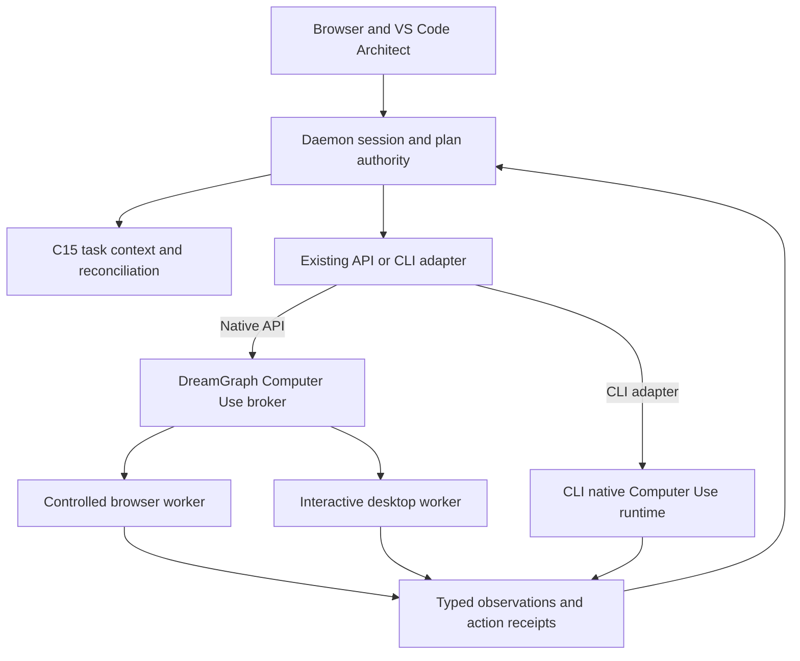

# Ashoka Computer Use — execution design and delivery packet

**Governing rule: Use the best native capability available, and normalize the contract above it.** Native execution is selected by the adapter; shared guarantees remain above that boundary.

Revision 7, 2026-09-30; original capability research retained from revision 6. Proposed C17 within [DreamGraph v14.0.0 - Ashoka](../../../plans/graph-trust-and-agent-effectiveness.md); implementation is pending review. [Capability/source audit](computer-use-capabilities.md), [feature request](owner-computer-use-request.txt), [execution proposal](owner-computer-use-execution-proposal.txt) and [owner clarifications](owner-computer-use-followups.txt) are its evidence. GPT-6.1 Sol is the owner's intended executor for the whole v14 plan; that does not select or require Sol as the product's Computer Use model.

## Wants, musts and realities

**Wants:** operate browsers and native applications, combine vision with DOM/accessibility, work autonomously within permission, learn from outcomes through the graph, recover unfinished work and feel native to compact Architect. Preserve this ambition across Windows, macOS and Linux.

**Musts:** platform-neutral contract; explicit target scope and authority; C15 graph integration; isolated sessions; C14 lifecycle correctness; separate observation and verified outcome; bounded spend; effective cancellation; provider/model independence; native CLI continuation; no OS-specific types or assumptions defining the shared architecture. Missing any of these blocks a route's activation and release claim. A capable model is not an authority grant.

**Realities:** browser control is the strongest common starting point. Desktop permission, display servers, accessibility coverage, focus and packaging differ. The [platform table](computer-use-capabilities.md#platform-realities-and-remedies) specifies remedies and remaining limits. Implement portable contracts/fakes first, then a working browser baseline on all three OS families; desktop workers are peers under that contract. Windows is not the reference definition to port later.

Planned Ashoka scope includes native-worker work for Windows, macOS and Linux Wayland/AT-SPI, with an explicitly scoped X11 fallback. Qualification is per operation and environment, not one green checkbox per OS. If a backend misses release, record a maintainer-reviewed scope deferral, reason, owner and follow-up while keeping its contract/fixtures; it remains disabled. Do not silently reduce the native-app ambition or waive the musts to advertise support.

## Authority and execution ownership

This is one executing Architect task. The worker is an actuator/observer, not a second agent, scheduler or graph authority. It cannot invent tasks, call a model, grant itself scope or mark a slice complete.

**Adapter determines the execution mechanism.** Codex CLI uses its own Computer Use runtime when the native capability is available and qualified. Native API adapters use the DreamGraph harness and its browser/desktop workers. Other CLI adapters negotiate their own native facilities. The common contract governs authority, observations, outcomes and recovery; it does not require native Codex actions to detour through a DreamGraph pixel executor. A separately requested bridged route can use that executor, with an explicit effective-mode change. Unavailable native capability is never silently replaced.

"Best" means the most capable, reliable native route that satisfies this task's effective scope and constraints. Preserve richer native features through advertised, versioned capability extensions; the common contract is a floor for guarantees, not a ceiling on execution. Choosing a method within an existing grant is routine; changing provider/model, host, disclosure or authority still follows the corresponding policy.

| Responsibility | Owner and boundary |
|---|---|
| Session, selected versus active work, eligibility, authority, budgets | Existing daemon/Architect session authority from Slices 11/21/25; one `computer_use_session_id` belongs to an `execution_id`, project and authenticated principal. |
| Model loop and continuation | Existing selected API/CLI adapter. It negotiates modality/tool support, maps provider-native calls, supplies results and preserves mandatory context. |
| Dispatch and result journal | DreamGraph broker checks each harness operation. A CLI-native route enforces the translated grant through its own supported controls and reports normalized receipts to the same daemon execution. Both reuse durable job/receipt semantics. |
| Browser and desktop processes | Versioned host worker; portable Node/browser process or per-user native helper. Worker authenticates daemon and revalidates lease, scope and observation before any input. |
| Pixels and local input | DreamGraph worker for native API; CLI-native runtime for CLI. Daemon owns disclosure policy and normalized evidence metadata. UI receives only supported, authorized previews/references; no forced duplicate screenshot upload through another model. |
| Stop/pause | Authority revokes or pauses the selected execution backend; DreamGraph workers have a local stop/watchdog, and a CLI-native adapter must prove equivalent effective control. Model cancellation alone is insufficient. |
| Graph and final lifecycle | Existing C15 reconciliation owner and C14 reducer. Worker observations are inputs, never self-certifying architectural facts. |

Reuse `packages/host` registry/gates/watchdog and SDK contracts where they fit; a plugin manifest alone is not a sandbox. Proposed new source seam: `src/architect/computer-use/` for daemon broker/session/observation logic, generated public types through `packages/sdk`, and worker adapters below `packages/host`. Native executables may be optional separately packaged assets. No production code at these proposed paths is claimed to exist.

**DreamGraph guarantees system correctness under valid use. The user owns operating discipline outside that contract.** Valid use means a documented supported route/version, declared instance/project/scope and satisfied authority/configuration prerequisites. DreamGraph must enforce those prerequisites and correctly preserve identities, committed state, reconciliation, concurrency, budgets, lifecycle, evidence and truthful results; a bug cannot be dismissed as operator discipline. A failed worker, interrupted write, stale UI or invalid request must produce the specified recoverable/error state. The user chooses when to work outside DreamGraph, when substantial out-of-band changes warrant an inclusive scan, and which optional paid/cognitive workflows to run. Do not impose recurring scans, suspicion-driven warnings or extra approvals for work already authorized within that contract. Unsupported/out-of-scope activity has an explicit boundary; the product does not claim to have observed it.

Contract foundations in 3/5/6/8/9/11/12/21/25/30 use specified fake worker/native-CLI events; they do not require Slice 31 to have already implemented CU. All real interaction/stop/permission/evidence obligations remain mandatory in 31/27. Normalize the best native route at its honest granularity: a CLI may expose aggregate action evidence, not every provider call. Qualify required authority, observed outcome, spend bounds and independent stop at that granularity; missing mandatory controls block the route. Shell sandbox alone and API-harness watchdogs do not attest native CLI control. XS17/20 joins CU01–24 to jobs, lifecycle, graph recovery and cross-instance seat ownership.

## Canonical contract

Keep semantic contracts in core/daemon and generate SDK/schema artifacts under C01/C02. Browser/desktop/provider handles remain opaque adapter-local mappings. Requested support, currently available support, permitted support and effective support are separate.

Route identity is `dreamgraph_harness` or `cli_native`, distinct from provider/model and transport. A CLI-native adapter supplies semantic probe/start/observe-status/control/outcome hooks; it need not export pixels or per-call API envelopes. Missing observation, audit, metering or enforcement fields remain explicitly unavailable. Required evidence/control cannot be replaced by a guessed receipt or a model's prose.

The records below define semantics, not a requirement to expose every native internal. Harness operations populate action-level records; a CLI may supply native event/batch receipts with explicit granularity and native references. Coordinate fields apply only to coordinate observations; absent pixels, provider call IDs or per-action telemetry are represented as unavailable, never synthesized. A task can use that route only if its required authority, bounded execution, evidence and recovery guarantees are still provable at the declared granularity. Validate each capability profile with the same conformance cases, without forcing private CLI internals into the worker port.

| Record | Required semantics |
|---|---|
| `ComputerUseCapabilities` | Contract version; backend/version and probe time; authority/worker host IDs; OS/user-session kind; supported operations and target kinds; text/DOM/accessibility/image modalities; native/bridged/unavailable route; image/coordinate limits; local-stop/input-detection/isolation support; unsupported reasons/remedies; provider/model/endpoint/CLI prerequisites and qualification evidence. |
| `ComputerUseSession` | Instance/project/principal/session/execution/plan/slice IDs; requested/effective mode and target scope; capability/config/grant fingerprints; graph-context receipt; worker epoch; event cursor; job/day budget reservation; lease and state; evidence/retention policy. Selection is not part of the authority grant. |
| `TargetRef` | Opaque target ID plus generation; host and interactive session; kind `browser_tab`, `application_window`, `display` or `isolated_desktop`; permitted origins/apps and action classes; identity assurance. A window title is descriptive, not identity. |
| `ObservationRef` | ID, monotonic sequence/time and wall timestamp; execution/target/generation; document/viewport/display topology revision; dimensions, crop and coordinate transform; source kind; privacy classification/redaction version; artifact digest/reference/expiry; graph revision/context receipt. |
| `ActionRequest` | Stable operation ID and adapter call ID; session/execution/target; worker/lease epoch; observation or structural-ref generation; operation/arguments; expected preconditions and desired postcondition; claimed effect class checked by policy; deadline; grant/approval and budget reference. No client-supplied arbitrary scope override. |
| `ActionReceipt` | Accepted/rejected/dispatched/observed/failed/cancelled/unknown outcome; executed/skipped operation indices; before/after evidence; actual method and target; error/remedy; usage/reservation disposition; durable sequence/revision; reconciliation obligation if material. |

Initial worker port: `probe`, `openSession`, `observe`, `act`, `pause`, `revoke`, `getStatus`, `closeSession`. Authority, approval and budget issuance are private daemon operations, not model tools. The model-facing catalog may expose bounded `computer_observe` and `computer_act` plus status through the existing MCP registry; names are provisional until Slice 12 reconciles the catalog. Never expose unrestricted script execution or an arbitrary worker URL as the baseline tool.

For CLI-native mode, retain the CLI's own tool names, screenshot channel, batching and continuation. Integrate supported native permissions/hooks/events at the adapter boundary, with the existing MCP channel supplying graph reads/writeback and necessary authority decisions. `PreToolUse` around a code-execution call does not prove control over every nested GUI action: the native surface must enforce the scope itself. Compile only policy constraints it can honor; otherwise return a concrete integration gap and block the required mode. Amend ADR-217 to allow this scoped native Computer Use route without broadly reopening native shell/filesystem bypasses. Never enable all CLI plugins or inherit all personal browser grants just to make it work.

Operations: observe pixels/structural state; focus a granted target; navigate a permitted browser origin; activate an observed element; fill a known editable element; pointer click/move/drag; scroll; bounded key chord/text; bounded wait; explicit outcome observation. File transfers use existing governed file APIs or separately scoped upload/download operations. Resolve element references only in their original target/document generation and recheck actionable/visible/enabled state. Type literal Unicode text separately from key sequences; normalize scroll units, modifiers and coordinate transforms inside each adapter. No shared contract may require Windows key names or desktop handles.

Errors include `unsupported_capability`, `permission_required`, `scope_denied`, `target_gone`, `interactive_session_unavailable`, `stale_observation`, `lease_conflict`, `lease_expired`, `budget_exhausted`, `provider_refused`, `incomplete_response`, `cancelled` and `outcome_unknown`. Include whether re-observation, human handoff or a fresh grant is required. A failed image channel cannot silently become text-only success.

## Worker transport, isolation and physical control

The following worker mechanics describe the DreamGraph harness. CLI-native adapters reuse their native runtime and qualify equivalent outcomes instead of rebuilding it. Native policy/permission/events and stop APIs must provide the required guarantees; hooks alone are not assumed sufficient. Cross-route control of the same physical seat needs a supported shared lease or an exclusively assigned interactive session. If a CLI cannot coordinate that lease, it cannot concurrently share that desktop with a DreamGraph worker.

Use versioned authenticated local IPC: ACL-bound named pipe on Windows, user-restricted Unix socket on macOS/Linux. Validate peer user/session and instance pairing, message sizes, sequence/epoch and protocol version. A random socket/pipe name alone is not authentication. Bind grants to a specific host worker and target; redact them from logs. Desktop helper runs without administrative privileges in the interactive user's session. Optional authenticated remote workers are deferred behind explicit pairing, encryption and visible remote status; local-only daemon defaults remain.

Browser worker uses a fresh task profile or explicitly retained isolated profile, with restricted downloads/files/network and no inherited personal credentials. Use portable Playwright locators/accessibility where appropriate; reserve screenshots for ambiguous/canvas/visual checks. Page JavaScript, service workers, popups, redirects, frames, downloads and network requests must obey scope too. Restrict access to daemon/admin endpoints and unrelated loopback/private hosts; a page cannot click its way into granting itself authority. A profile is logical isolation, not a complete hostile-page sandbox: qualify browser/OS sandbox and network/filesystem confinement separately.

Desktop input lease is **host + interactive user session + physical input seat**, arbitrated by one per-user helper across all DreamGraph instances. A daemon-local mutex would allow two daemons to fight over the same keyboard. One physical input owner at a time; observation may coexist only within each grant. Isolated browser contexts/desktops can execute independently if they do not share an input seat. Second clients can observe authorized status, but cannot steal control through selection, refresh or unscoped stop.

Lease sequence: observe → acquire → revalidate → interact → observe result → release. Human input or target/focus/display change pauses dispatch and invalidates relevant observations. Workers must distinguish their own injected input where supported. If reliable human-input detection is unavailable, report it and require an isolated environment or attended single-action mode; do not claim automatic takeover protection. Always provide a local stop control, with no model or network dependency. No unbounded batch may hold the keyboard; release held keys/buttons on failure/revocation.

Before dispatch, revalidate target identity, focus where needed, scope, modal/occlusion state, display mapping and observation freshness. Any detected relevant change rejects old coordinates. Visual pixel comparison cannot make a native click and UI state atomically consistent: disclose the residual race, use structural target operations where possible, and require human handoff for consequential actions whose target cannot be verified reliably. Never promise that screenshot age alone proves safety.

## Persistence, replay, cancellation and recovery

Durable: session identity/scope/policy, action intent/status journal, approvals, privacy-filtered evidence descriptors, usage reservations, event cursor and material-change obligations. Ephemeral by default: raw pixels, clipboard data, passwords, runtime variables, browser/OS object handles and active leases. Optional persistent browser profiles are credential-bearing resources with a distinct retention/cleanup policy. They are not graph data.

Journal action intent before dispatch. Deduplicate by execution + operation ID; preserve the provider call ID as a separate correlation. If a result is lost, query/recover the receipt rather than blindly repeating the click. A crash after dispatch but before confirmation produces `outcome_unknown`. External GUI effects cannot be guaranteed exactly once or rolled back by the graph journal. Re-observe the real state and reconcile before retry; replay must never resubmit an email, purchase or destructive action.

Stop has priority over model, tools and pending approvals: revoke the lease, reject later dispatch, interrupt capture/input workers, release input, request provider/CLI cancellation and persist partial/unknown outcomes. Do not wait for a model request timeout. Initial test targets: no new operation after revocation is accepted; responsive workers release held input within one second; a severed control channel stops input within a five-second lease expiry. Measure actual limits and keep routes disabled if they cannot meet the declared bound. Already delivered input or remote side effects may finish; report that honestly.

**Maintainer-approved clarification, 2026-10-03:** The one-second bound covers releasing held input, cancelling further actions and relinquishing control. Confirmed termination of the owned browser/worker process tree has a separate five-second bound measured from the same Stop request, with bounded escalation. An input-release acknowledgement is not Stop complete: expose `stopping` / input released while termination is pending. If termination is unconfirmed at the bound, retain `recovery_required` / termination unconfirmed and the original stop-only recovery identity. Do not settle the execution's computer lifetime or advertise successful Stop until termination is confirmed. For the isolated browser, closing the actual virtual input target proves release; a local cancellation flag alone does not. The original five-second control-loss ceiling and pause boundary remain unchanged.

Pause drains to an observed boundary, releases physical control and preserves resumable task state. Resume reacquires authority, budget and lease, refreshes graph context, probes capabilities and takes a fresh observation. Do not replay runtime variables or reuse old coordinate references. A worker/daemon restart increments its epoch; old commands cannot run. Crash recovery finds unfinished operations by journal, not assistant prose.

Architect tab refresh reconnects to the same daemon execution and event cursor; it does not start another job. Work in an isolated browser may continue under its finite grant. Shared physical-desktop interaction pauses when required operator presence disappears; an explicitly unattended grant may use an isolated desktop only. Helper loss, app closure or missing permissions blocks the affected capability and slice; another session remains unaffected. A stale browser tab cannot cancel a new execution under a reused UI selection.

Use C04’s durable commit marker and retained receipt epochs, C05/ADR-239’s single cancellation owner and C14’s separate verification/export obligations. Source/GUI effects may precede graph publication; unknown effects remain inspectable and never replay automatically. No new private CU job database, scheduler or lifecycle reducer. A stopped model call can still incur late usage; settle it without admitting new actions. XS17/20 joins the actual native control granularity, isolated worker lifetime, cross-instance seat and graph recovery evidence.

## Security, approvals and privacy

Reuse C09 grants and C13 autonomy. Explicit per-session/profile enablement defaults off. `observe`, `interact` and bounded full access are independent of model choice. Full access retains double human confirmation, scope, expiry, revocation and finite caps. Provider-specific restrictions can be stricter; the effective policy is the intersection of user authority, DreamGraph policy, worker/OS limits and provider rules.

| Action class | Required authority and handling |
|---|---|
| Observation / navigation | Named target/site grant and disclosure policy; observation can expose private data or trigger network requests. No unrelated window, monitor, cookie store or clipboard access. |
| Ordinary reversible interaction | Existing in-scope grant can cover repeat actions without modal spam. Check target, preconditions and known effects at each dispatch. Unknown consequences require a narrower operation or human decision. |
| Filesystem change / upload / download | Existing filesystem and transfer authority, named paths/destinations and expected changes. Verify saved bytes/state where possible; isolate download staging and do not auto-run downloads. |
| External messages, account/security changes, financial or destructive effects | Exact target/recipient/content/effect preview and applicable action-time confirmation. A scope grant or autonomy label cannot silently authorize the final consequential step. Preserve any stricter provider rules. |
| Secrets and authentication | Prefer human handoff or executor-local secret references to a verified destination. Never return credentials/OTP/payment data in model-visible results, pixels or audit previews. Credential handling needs explicit disclosure/use permission; entering a field may already transmit it. |
| Privileged OS / secure desktop / safety barriers | Unsupported automation boundary; human handoff. No elevation, TCC/portal bypass, security-warning bypass or self-approval through Architect UI. |

Model-reported effect classes, page labels, accessibility names and on-screen instructions are untrusted. They cannot grant permission or attest a safe effect. Enforce app/site/action policies and known semantic operations in the broker; a deceptive "Save" label must not become authorization to send data. For arbitrary unknown interfaces where effects cannot be bounded, narrow scope or ask at the uncertain boundary rather than pretending a pixel click is semantically classified.

Default pixels stay in worker memory long enough for the current bounded exchange and inspection, then expire; no durable screenshots by default. Provide a separately selected encrypted local artifact store with finite TTL/size for debugging/evidence. Persist sanitized observations, digests, extraction/redaction versions and expiry/deletion tombstones in the evidence ledger. A digest proves content identity only, not its meaning; an expired image must be labeled unavailable, never described as independently re-verifiable.

Apply redaction **before** model transmission, audit logging and UI preview. Mask known secret fields, excluded regions and notifications where reliable; crop to the granted target. OCR, DOM text, accessibility values, URL query strings, console/network logs and clipboard may also contain secrets. No promise of universal pixel redaction: if the necessary capture cannot avoid unrelated/sensitive content, stop or obtain a narrower explicit grant. Do not capture other monitors merely to search for a target. Disable clipboard reading by default; local secure entry must not silently overwrite a user's clipboard or expose its previous contents.

Provider retention is configured independently from local artifact TTL. Show which data leaves the machine, provider/model/endpoint, account policy status and any unsupported retention request. `store: false`, a local helper or CLI subscription is not a ZDR guarantee. No secrets or images in CLI argument strings, ordinary SSE events or the current raw bridge audit-body serialization.

## Graph evidence and lifecycle

Before work, obtain the C15 bounded context receipt: canonical plan/slice, relevant app/UI/workflow entities, ADRs, known evidence/freshness and previous verified outcomes. Use accumulated graph knowledge to target investigation, but live screen/DOM state governs current coordinates. During work, permit targeted retrieval and preserve mandatory evidence/authority anchors through compression and provider continuation.

Represent image observation, OCR extraction, DOM/accessibility observation, API-observed state, model interpretation, inferred UI semantics and confirmed postcondition as separate evidence kinds with parent references. An OCR string and the same screenshot are shared ancestry, not independent corroboration. Timestamp and bind each observation to execution, target generation and graph revision. "Save clicked", "toast visible", "file hash changed" and "change reconciled" are distinct claims with different strength.

After a material change, journal affected files/entities/UI/workflows, observed before/after state and uncertainty; use C15 reconciliation receipts, dirty generations and bounded digestion. Prefer API/filesystem verification of saved effects; when only visual evidence is available, retain its weaker, scoped claim. External application changes with no clear project entity get an execution observation, not invented architecture. Targeted digestion is optional paid follow-up under normal admission, never a screenshot-by-screenshot dream storm.

For C14, a slice may declare required capability IDs and acceptable explicitly reviewed alternatives. Missing required capability blocks eligibility; losing it mid-run records a blocker without marking unrelated work failed. Computer session state is projected into the existing execution, not another plan lifecycle. Proposed session states: `requested`, `ready`, `observing`, `interacting`, `awaiting_approval`, `paused`, `blocked`, `recovering`, `verifying`, `completed`, `cancelled`, `failed`.

`completed` here means the Computer Use task's desired state was evidenced, not automatic slice completion. Slice verification additionally requires its own acceptance and material-change reconciliation. Preserve partial actions and unfinished postconditions on stop. Resume identifies the correct execution/current slice and pending reconciliation; it does not infer success from a CLI exit code, a model's final answer or the last selected card.

A transient target/screenshot can expire by its explicit observation validity rules even while the underlying project graph remains current. Do not infer graph staleness from scan age, and do not refresh the whole project graph for every observation. Required postconditions produce grounded scoped evidence; optional paid digestion is separate. A qualified native route normalizes honestly at its exposed granularity instead of fabricating per-action telemetry.

## Compact Architect experience

One compact execution row: **Computer Use · Observe/Interact · target · worker host · actual adapter/model · state**, with Pause/Stop and a disclosure for details. Text/icon states supplement restrained color. A small observation drawer contains latest sanitized preview, structural evidence, action/receipt history, budget/usage, grant expiry and recovery reason. No large permanent control panel or redundant per-action confirmation dialogs.

Setup selects isolated browser or an available desktop target, previews data disclosure/effective capability, then starts the granted task. Unsupported routes show a specific remedy. Existing-browser attachment and remote targets are visibly different choices. Approval cards show the concrete pending action and what has already run. C16 context menus can offer "Inspect with Architect" or "Verify in browser" as editable task drafts; selecting a target or drafting a prompt does not begin control.

The daemon is the common projection for browser and VS Code. The extension uses native editor/file APIs for editor work before attempting GUI automation. In remote VS Code, show the workspace host and interaction host separately. Concise verbosity never hides permissions, unknown outcomes, stale evidence or required action. Dashboard configuration extends C07 with enablement, worker/target profiles, limits, retention and permission diagnostics, with template preview/reset/undo; secrets remain protected.

## Cost and context

Meter requests, input/output/image tokens when available, screenshot dimensions/bytes/count, tool calls/actions, wall time and retry count. Distinguish observed usage, conservative reservation, estimate and unknown. API spend uses the selected provider's verified price table, region/tier/context band and cache rules; CLI subscriptions use their actual reported units/limits, never fabricated dollars. Unknown paid price blocks admission unless an explicitly configured defensible upper bound can enforce the monetary cap. No universal canary budget is assumed.

Initial proposed engineering limits, adjustable through validated config: 20 model turns, 100 input actions, 40 model-visible screenshots, 15 minutes per session, 30 seconds per action, one retry for an idempotent read and zero automatic retries for ambiguous mutations. Monetary run/day caps remain zero/unset until explicitly allocated. Both authority and worker enforce finite limits; model output, native batches and scripts cannot bypass action counts. Concurrency reserves shared day allocation before dispatch; unknown result cost remains reserved until resolved.

Bound DOM/accessibility output and history. Prefer changed structural state, short action groups and fresh targeted crops when the selected tool schema supports their coordinate mapping. Unchanged-image hashes can avoid unnecessary local capture/upload, but do not imply provider image caching or a delta-image API. Never send a raw image diff when the model expects a full screenshot. Keep required plan/authority/graph evidence and the latest relevant visual state; strip stale large images according to the adapter's native continuation rules.

Benchmark task success first, then time-to-first-observation, model/tool latency, images/turns, tokens and total billed/reported usage. Compare structured versus visual execution on the same disposable tasks. Budgets must stop work with durable partial results, not buy a stronger model, expand scope or abandon reconciliation silently.

## Slice 31 execution packet for GPT-6.1 Sol

These eight work packages refine **one** parser-recognized Slice 31; they are not additional slice headings/IDs. Execute in order, with the listed cross-platform work completed before the final gate. Reuse outputs of dependencies rather than reimplementing session/lifecycle/model systems.

| Package | Change and code entry points | Exit evidence / block condition |
|---|---|---|
| 31A — Freeze the boundary | Re-read C01–C17 and ADR-217; inspect changes landed in Slices 8/11/12/21/25. Add core semantic schemas/generated SDK types, worker port and fake worker/provider fixtures at the proposed seam above. Negotiate requested/supported/permitted/effective capabilities. | Golden serialization vectors for Windows/macOS/Wayland/X11/browser/remote identities; no OS handles or provider continuation in common types. CU01/CU08/CU24. Block on unresolved authority ownership or an API-only contract. |
| 31B — Broker and receipts | Extend daemon execution owner, `packages/host` gates/watchdog and existing receipts with authenticated worker pairing, target grants, cross-instance input-seat lease, intent/result journal, budgets, revocation and recovery. Add typed errors/events. | Fake worker demonstrates scope rejection, duplicate/lost result, restart, two clients/two daemons and independent stop. CU04–CU07/CU10–CU13. No real input until this gate passes. |
| 31C — Portable browser | Add optional Playwright worker with pinned supported runtime/browser, isolated task profile, structural operations and scoped screenshots, file/network restrictions, native-dialog handoff and cleanup. Use a local fixture page with hidden/disabled controls, moving targets, modal, frame/popup, canvas and a simulated external submit. | The same fixture succeeds on Windows/macOS/Linux without paid calls. CU02/CU03/CU14/CU15/CU19. Block if worker requires an unsupported runtime or cannot enforce confinement. No attachment to personal profiles for development tests. |
| 31D — Native workers as peers | Implement thin per-user helpers: Windows UIA/capture/input; macOS AX/capture/input with permissions; Linux portal/PipeWire/EIS and AT-SPI, optional X11. Reuse platform APIs, not an improvised private provider protocol. Pin helper toolchains and licenses; expose per-operation diagnostics. | Named OS/version/compositor/architecture matrix, denied/revoked permissions, target loss, input-seat contention, scale/topology and local stop traces. CU16–CU18. Fake tests alone cannot mark a backend supported; record hardware gaps for reviewed deferral. |
| 31E — Adapter-native wiring | Native API: extend `src/cognitive/llm.ts` and native tool loop for DreamGraph harness images, OpenAI computer/custom-tool and Anthropic versioned toolset/custom-tool mappings. CLI: integrate Codex's native Computer Use discovery/permissions/events/control through the existing CLI adapter; probe other CLIs separately. Keep native image/continuation handling; daemon MCP supplies graph/governance. Review scoped ADR-217 amendment. Remove raw pixels/secrets from audit previews. | API transcript fixtures plus fake/native-CLI adapter contract tests cover images or honest unavailable previews, scope/approval, event receipts, refusal/incomplete/cancel, call IDs and C15 writeback. CU08–CU10/CU20/CU24. Prove nested native actions obey grants; flags or shell sandbox alone do not pass. Never silently substitute a DreamGraph worker for requested CLI-native mode. |
| 31F — Graph and lifecycle | Connect observations/material changes to C15 context/receipt/dirty/digestion owners and C14 eligibility/recovery. Preserve provenance kinds, partial outcomes and screenshot tombstones. | Known file/UI mutation flows from observation to source verification to graph receipt to next-agent retrieval. CU11/CU21/CU22; click success cannot advance slice status. No new evidence database competing with existing owners. |
| 31G — User controls and diagnostics | Wire compact status/drawer, target/setup/preflight, effect-specific approvals, local emergency stop, pause/reconnect and dashboard schema fields. Reuse C16 menus and C07 template workflows. Publish requested/effective mode and host identity on browser and VS Code. | CU05/CU07/CU12/CU23; keyboard access, status without color, stale-client/wrong-target rejection and no confirmation spam for already permitted actions. |
| 31H — Qualification and release evidence | Run the CU matrix, compare native/bridged semantics and structured/visual task outcomes, retain explicit unsupported routes, prepare optional pinned real-provider canaries and install/upgrade/uninstall docs. Hand results to Slices 27/28. | Required offline cases and supported-platform traces pass; opted-in live results are separate. No paid canary absent allocation. Publish exact limits and qualification dates, not "works on every computer". |

Existing source anchors: [Architect](../../../src/architect), [providers](../../../src/cognitive/llm.ts), [host](../../../packages/host), [SDK](../../../packages/sdk), [reconciliation](../../../src/tools/reconciliation-transaction.ts), [maintenance](../../../src/cognitive/graph-maintenance-state.ts), [VS Code ports](../../../extensions/vscode/src/architect-core/ports.ts), [tests](../../../tests). Candidate new tests: `tests/architect-computer-use-contract.test.ts`, `tests/architect-computer-use-recovery.test.ts`, `tests/architect-computer-use-adapters.test.ts`, worker integration fixtures and a real browser fixture suite. Names are proposals, not existing coverage.

At each package exit, append a bounded implementation-log entry under the actual projected Slice 31 ID with changed files, source/config/schema hashes, commands and results, CU case IDs, platform/adapter versions, limits and next package. Do not add implementation checkpoints during this planning revision. Stop and request a specific design decision only if evidence requires changing a must, introducing a new trust boundary, relaxing scope or changing reviewed release support. Routine library/API choices within the contract belong to the executor.

Revision-7 handoff: predecessors provide real core persistence/admission/authority and contract doubles for future CU. 31A confirms those frozen schemas instead of redesigning them; 31B is the authority/stop gate before physical input; 31C/31D are peer qualified backends; 31E follows the selected adapter; 31F/31G integrate existing C15/C14/UI; 31H supplies the actual evidence deferred by predecessor slices. The [32-slice handoff trace](execution-simulation.md#s31) and XS17/20 resolve the earlier acceptance dependency cycle. One backend’s success cannot waive another backend’s mandatory contract or imply qualification.

## Acceptance matrix

All cases below are **specified, not run**. Core tests use fake clock/worker/provider/CLI, deterministic recorded frames/trees and disposable state. Browser tests execute a real controlled browser with synthetic responses; OS tests execute a real helper against dedicated fixtures and need no paid model. Provider canaries are a separate opt-in layer.

| ID | Scenario and required outcome | Evidence level needed |
|---|---|---|
| CU01 | Requested capability differs from available/permitted support; common contracts contain no platform handles; incompatible version fails explicitly. | Schema + fake workers for every platform. |
| CU02 | Observe fixture, resolve correct control, activate, type Unicode, scroll/navigate and read back expected values. | Real browser on three OS families; native fixture for each advertised backend. |
| CU03 | Move/re-render/scroll target after observation; reject stale reference/coordinates and re-observe before acting. | Browser + native coordinate/scale fixtures. |
| CU04 | Out-of-scope window/site/path/monitor, iframe/popup/redirect, daemon admin page or spoofed worker is rejected. | Broker/IPC negative tests + confined browser. |
| CU05 | Stop during capture, model wait, key hold and queued batch; no later action dispatch, released input, accurate partial result. | Fake clock plus real worker stop-latency traces. |
| CU06 | Two sessions and two daemons compete for the same physical seat; second cannot steal it; independent browser contexts remain isolated. | Broker + per-user helper test, no shared cookies/artifacts. |
| CU07 | Browser refresh/disconnect/reconnect and stale UI control; same execution/event cursor, no duplicate action; physical-control presence rule holds. | Real Architect browser with fake model. |
| CU08 | Unsupported model, endpoint, image channel, CLI/plugin or worker version; no silent text-only downgrade or model escalation. | API/CLI contract fixtures. |
| CU09 | Refusal, incomplete response, batched action failure, oversized image or unknown action; preserve IDs and return native errors/skips. | OpenAI and Anthropic transcript fixtures. |
| CU10 | Lost reply and duplicate call across crash after input; query journal, outcome unknown until observed; never replay consequential action. | Failure injection at every intent/dispatch/receipt boundary. |
| CU11 | App closes, worker dies, daemon restarts, capability disappears; block correct slice, invalidate epoch, recover actual unfinished state. | Worker/process + lifecycle integration. |
| CU12 | Consequential action, credential entry, full-access grant expiry or revocation; correct action-specific approval/handoff and no UI self-grant. | Authority negatives + synthetic forms, never a real payment/message. |
| CU13 | Parallel job/day allocations, unpriced model, CLI usage units, image/action/turn/time exhaustion and unresolved request cost. | Deterministic budget traces; no surprise paid request. |
| CU14 | Deceptive label, hidden/disabled control, unexpected modal, overlapping window or focus theft. | Adversarial browser/native fixtures; target remains verified or action stops. |
| CU15 | Slow render, layout animation, DPI/zoom, crop, negative monitor origin and display topology change. | Transform vectors + real worker; no guessed coordinate reuse. |
| CU16 | Windows user/service separation, locked desktop, integrity mismatch, capture-only availability and human input. | Dedicated Windows session; no elevated/secure-desktop workaround. |
| CU17 | macOS accessibility/capture permissions separately denied/revoked, Retina scale, app/space change and local stop. | Dedicated macOS fixture; signed helper identity recorded. |
| CU18 | Linux Wayland portal cancel/revoke, stream mapping/EIS, missing compositor support; AT-SPI gaps; scoped X11 display. | Named GNOME/KDE/X11 environments; unsupported cases labeled. |
| CU19 | Headless/WSL/SSH/remote VS Code, incompatible Node/browser, popup/native dialog and existing-browser attachment. | Host identity/preflight + portable browser; no implicit client-desktop access. |
| CU20 | Images, DOM values, secrets and action arguments through native API, MCP proxy, CLI audit, UI preview and log retention. | Synthetic secret canaries; no pixel/base64/secret leakage to ordinary logs. |
| CU21 | Material UI/file change reconciles to affected graph entities/dirty generation; next agent retrieves correct evidence/uncertainty. | Full C15 receipt/retrieval trace, no screenshot-as-fact promotion. |
| CU22 | Tool success with wrong postcondition, expired screenshot, OCR/shared-ancestry inference or unreconciled mutation. | Evidence/lifecycle negative tests; slice remains unverified. |
| CU23 | Compact status, keyboard/local stop, approval inspection, selected versus active target, concise verbosity and recovery messages. | Real browser/VS Code accessibility and multiclient fixture. |
| CU24 | Codex adapter selects qualified Codex-native Computer Use; native API selects DreamGraph harness. Missing CLI capability blocks without silent worker substitution; alternate route needs explicit selection. Revoke stale grants after upgrade/uninstall and handle old clients. | Semantic conformance + native permission/event/stop proof and compatibility/install/recovery tests. |

Opt-in live canaries use pinned provider/model/tool schema and worker versions, explicit run/day reservation, disposable local fixture or isolated test desktop, declared data/retention and sanitized outputs. Validate observe→act→verify, a refusal/stop, bounded usage and graph writeback. Never run them against production accounts to prove the feature. A skipped canary is reported as unverified provider behavior, not a passed end-to-end qualification.

## Compatibility, release boundaries and remaining decisions

Default disabled on upgrade; old clients retain existing behavior and see an explicit capability-unavailable result if they request an unsupported contract. Never migrate an old autonomy/full-access flag into a desktop grant. Version session/observation/receipt formats independently from product 14.0.0; deny unsupported semantics, preserve audit/reconciliation records, expire leases and re-grant after incompatible worker upgrades. Worker removal clears scoped secrets/profiles according to policy without erasing evidence of effects already performed.

Deferred unless separately qualified: arbitrary model-generated code execution, personal-browser attachment, provider app-private bridges, unattended shared physical desktops, remote/cloud workers, privileged/secure OS controls and guaranteed automation of every toolkit/application. Structured browser and native-worker work remain planned; particular unsupported actions must have reasons and remedies. App-specific APIs and normal MCP/filesystem/terminal tools remain preferred when they are more reliable; Computer Use primarily closes missing-interface and visual-verification gaps.

Resolved direction: one canonical C17 contract; Codex-native Computer Use for Codex CLI and DreamGraph harness for native APIs; daemon authority over both without forcing shared transport; no Windows-first semantic model; ephemeral pixels by default where enforceable, verified effects/recovery and dedicated Slice 31. Bounded implementation inputs: exact worker toolchains/licensing, tested OS/architecture/compositor matrix, allowed account/model prices/retention and CLI native feature/permission/event/stop integration. Owner: Slice 31 lead with platform maintainers, authority/privacy reviewer and release verifier. Record decisions in 31A/31D/31E/31H; default unsupported until evidenced.

NP14 covers four nervous boundaries: physical input cannot be made transactionally atomic with screen state; OS scope/permissions differ; uncertain external effects cannot be retried as graph writes; local observation can disclose remote-model data. These do not weaken the musts. They determine safe routing, blocked/handoff states and accurately limited release claims.
