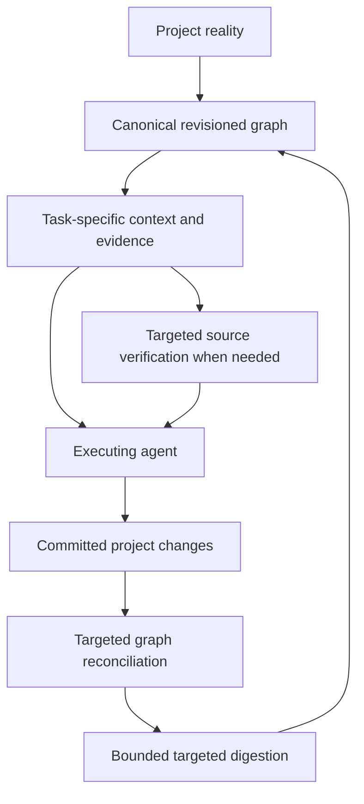

# Graph-centered agent execution and bounded digestion — v14.0.0 - Ashoka

Date: 2026-09-30  
Status: proposed contract C15; implementation and comparative evaluation are pending.  
Authority: the owner's [graph execution request](owner-graph-execution-request.txt), incorporated into the [v14 plan](../../../plans/graph-trust-and-agent-effectiveness.md).  
Integration owner: Slice 25's client/adapter owner, with core retrieval, persistence and scheduler owners responsible for their boundaries. Preserve all 32 current slice IDs.

## Execution invariant

DreamGraph is accumulated architectural memory: relationships, provenance, decisions, constraints, history, workflows, capabilities, evidence, tensions, causal/temporal knowledge, human intent, validated insights and consequences of earlier work. Its value must reach the agent before decisions, then grow from verified work. Indexing files or exposing optional retrieval tools alone does not fulfill this contract.

Every shipped project-execution surface must participate in this loop by default, with observable receipts or an explicit reason why a stage cannot run:

Use fresh, trustworthy graph knowledge before broad repository rereads. Targeted source inspection remains authoritative for verifying executable behavior, reconciling contradictions or filling gaps. Graph presence, a successful query, or a large injection does not establish sufficient understanding. Source rereads are justified when evidence is stale, uncertain, incomplete, contradictory or required by the task; record the reason without turning it into another approval dialog.

The invariant applies to repository reasoning, implementation, review, governed mutations and project cognition, including material documentation/configuration/plan changes. Read-only work has a no-change outcome and need not manufacture a graph mutation or a dream. Generic help/non-project UI actions are declared out of scope. An exception must state scope/reason, knowledge limits and recovery path; it cannot silently become the ordinary connected execution path. Every managed, supported, connected project-execution path must pass the loop contract for v14 release. An unsupported label is not a waiver for a shipped default integration; external-client non-attestation and actual degraded incidents are separate, tested limitations.

## Existing decisions and verified boundaries

The [read-only probe](graph-execution-probe.json) retrieved accepted ADRs from the DreamGraph instance. It also returned a health report labeling scan/enrichment stale, alongside missing baseline revision and incomplete semantic evidence. Revision-7 review found scan-age-based false-positive logic: those reported age labels are not accepted as proof of a stale graph, and a missing scan baseline does not negate later reconciled knowledge. The 1,400-token RAG request reported 1,419 tokens and returned largely provisional structural descriptions. Concrete missing evidence or detected mismatches support focused source verification; scan age alone does not; they do not demonstrate that graph assistance already outperforms source reading or that all surfaces bypass the graph.

Targeted source review found graph-first, write-back and targeted-dream instructions already in [browser Architect](../../../src/architect/routes.ts) and [CLI prompt serialization](../../../src/architect/cli-bridge.ts). They currently demand at least two focus hops for major-implementation follow-up. [Event routing](../../../src/cognitive/event-router.ts), [maintenance state](../../../src/cognitive/graph-maintenance-state.ts), [incremental reconciliation](../../../src/tools/incremental-reconciliation.ts) and the [journaled commit boundary](../../../src/tools/reconciliation-transaction.ts) already provide parts to extend. End-to-end enforcement, durable dirty generations and all-surface convergence are acceptance work, not established by finding those instructions.

| Existing ADR | Alignment requirement |
|---|---|
| ADR-047 / ADR-097 | Preserve curated, relevance-gated graph context and mandatory evidence reservation. Do not add unconditional extra fetches or silently discard graph/ADR anchors under compression. Revisit the accepted allocation through an ADR if changing it; do not equate more reserved tokens with more useful knowledge. |
| ADR-171 / ADR-172 | Retain narrow reader/recorder ports and effect isolation. DreamGraph-connected adapters implement this contract; generic sparse/null backends remain explicitly identified. Do not import MCP-specific types throughout the provider-neutral orchestrator. Verify current code locations rather than treating historical ADR paths as current files. |
| ADR-177 | Incidental context-touch telemetry may remain best effort. Material project-change reconciliation and its durable receipt cannot use swallowed fire-and-forget recording; amend the contract where necessary. Reading a node is not corroborating it. |
| ADR-198 / ADR-217 | Keep native CLI execution, bounded prompt-file injection and the daemon MCP bridge. Existing managed-CLI fail-closed/governed-tool rules remain binding; C15 does not authorize bypass through native shell tools when that boundary disallows it. |
| ADR-086 / ADR-203 | Provider continuation is optional transport/cache state, never an alternate project-memory authority. Verify routing/capabilities against C06; do not assume a connected provider can be reused by an unattended later digestion job. |
| ADR-207 / ADR-234 | Preserve durable Markdown plan history; crystallize verified outcomes into project knowledge and retire obsolete operational noise. Plans, prose and graph edits alone cannot prove implementation. |
| ADR-236 / ADR-237 | Reuse journaled, revision-checked writes and the shared read/exclusive write barrier. Commit receipts and consistent reads apply to reconciliation and digestion outputs alike. |

Resolve any required amendments in Slice 0 through the existing decision authority; this proposal does not mark a new ADR accepted. Replace the blanket minimum-two-hop follow-up instruction with measured affected-scope selection and explicit upper bounds during implementation. The owner-requested hop/cost controls govern expansion; even one-hop hubs need cardinality and token limits. Never schedule paid cognition merely to satisfy a prompt instruction.

## Before and during work: task context, not neighborhood dumping

Create a task-context request through the existing reader ports. It identifies instance/repository scope, task kind/intent, actor permissions, actual C14 plan/current slice and approval scope, working-tree/base hashes, affected entity IDs, changed or selected files, prior execution receipts and relevant questions. Selected UI focus is a retrieval hint, not proof of the active slice or authority to mutate it.

Core returns a bounded, revisioned context pack. It includes graph/evidence/plan revisions, source baselines, freshness/completeness/uncertainty, applicable constraints, selected records, immutable evidence references, selection reasons, omission categories and an on-demand continuation. Resolve human intent, ADRs, contracts, ownership, workflow/data relationships, relevant history/outcomes, tensions and temporal/causal knowledge where they matter. Facts, human assertions, hypotheses, dreams and validated insights retain their distinct meanings. Contradictions remain visible; relevant opposing evidence is not ranked away to make an answer cleaner.

Selection has a deterministic, explainable baseline:

1. Resolve exact plan/slice/entity/source anchors and authorization scope; retrieve applicable ADR/contract constraints and known blockers.
2. Reserve mandatory evidence and its provenance before optional context. De-duplicate shared ancestry while retaining distinct contradictory claims. Keep decision status and source/evidence identity through compression.
3. Rank optional context by task/changed-region relevance, relationship meaning, evidence quality, freshness and useful novelty. Expand only for an unmet task question or missing dependency; fixed hop count and node volume are not quality targets.
4. Fit complete records within separate content and transport budgets, accounting for all headings, citations, tool envelopes and continuation metadata. If mandatory evidence cannot fit, return `insufficient_budget` with the missing obligations and a bounded fetch/narrow-scope option; do not silently drop it or exceed a cap.
5. Record selected reasons, permission-safe omitted categories/known-or-unknown counts, estimated utility, context cost and remaining evidence access. Do not expose inaccessible entity IDs through explanations. This is a selection rationale, not hidden model reasoning.

Context starts from a committed snapshot. Before a consequential write, revalidate revisions/constraints covering the affected scope. During a long pass, refresh on relevant source/graph/plan changes, new evidence, tool outcomes or changed task scope; deliver a bounded delta or refetch the impacted pack. Do not refetch all context every turn or mix incompatible revisions. Own working-tree edits invalidate their source references immediately and are represented as an execution overlay until canonical reconciliation commits; a stale graph must not outrank a verified local edit.

Record a context receipt containing pack ID, effective revisions, required/elected evidence IDs, budget and truncation/omission status, adapter injection acknowledgement and explicit gaps. A delivered pack does not prove the model read, understood or used it. Tool/action checks validate required evidence and authority at applicable boundaries; task evaluation measures actual usefulness. Preserve these anchors in compressed prompts and resumptions, with deeper evidence available through bounded reads.

## Adapter and role obligations

| Surface | Context delivery | Change/closure contract |
|---|---|---|
| Browser Architect | Inject canonical plan/slice, evidence, relevant graph and execution history through current orchestration. Refresh at governed boundaries. | Bind actions to execution/context receipts; reconcile actual changes; show graph-sync and digestion state separately from C14 implementation status. |
| VS Code Architect | Use existing reader/recorder/context ports, selected-code hints and provenance-preserving compression. | Record actual edited scope and outcomes through the authority; reconnect/restart recovers outstanding obligations, not only a local transcript. |
| Native API adapters | Translate the same semantics to supported message/tool/context facilities. Optional continuation cache is bound to revision/model/session and refreshed when stale. | Retain native tool IDs and execution receipts; provider-held state cannot be the only copy of project changes or decisions. |
| Codex / Copilot CLI adapters | Keep native invocation and supported prompt-file/config mechanisms plus MCP bridge retrieval; never impose API continuation envelopes on child CLIs. | Host records delivered context and governed tool effects; completion requires reconciled changes or an explicit durable pending obligation. Preserve C13 autonomy/verbosity and existing CLI authority rules. |
| CLI, API and MCP resources/tools | Expose the same versioned bounded request/result/receipt semantics through generated contracts; examples make initial grounding and finish/reconcile the normal task workflow. | Mutating tools record canonical receipts/affected scope. External clients that read tools but execute elsewhere are not falsely attested as consuming context. |
| SDK, host and plugin executors | Shared hooks via current ports/contracts, with conformance fixtures and explicit capability negotiation. | Governed change manifests/finish operations; plugin failure cannot drop a reconciliation obligation. Unsupported clients report their gap. |
| Dreamer | Project affected neighborhood, constraints, relevant history, tensions and candidate diversity with provenance; exploratory hypotheses remain useful. | Candidates are speculative; record origin/ancestry/budget and dirty generation. No self-corroboration or automatic truth promotion. |
| Normalizer and other derived cognition | Evidence/contradiction/acceptance projection for the same canonical snapshot; relevant temporal, causal, tension, narrative and lifecycle dependencies. | Validate or reject through existing mechanisms. Reopen or invalidate derived claims when evidence changes; model confidence alone never clears staleness. |

The daemon can enforce its own orchestration/mutation boundaries and attest delivered context; it cannot guarantee arbitrary third-party MCP agents obey prompting or observe their private filesystem writes. Classify that integration as externally managed/unattested until it submits a change receipt or a watcher reconciles observed effects. Ship contract examples, bounded begin/refresh/finish semantics and conformance tests; do not claim universal enforcement from a tool description. Propose exact new/extended public commands in Slice 12 after auditing existing equivalents rather than inventing duplicate APIs here.

Graph-unavailable behavior is explicit and route-specific. Read-only targeted source investigation may proceed with a degraded receipt where existing authority permits it; approval-dependent mutations stop if mandatory constraints cannot be established. Managed CLI routes retain ADR-217's stricter failure behavior until a reviewed amendment. Sparse/no-graph generic port tests remain supported and honest. When connectivity returns, reconcile the declared backlog before claiming that the connected loop is complete. Missing graph knowledge is not a reason to bluff or automatically buy a full scan.

## Freshness and operator responsibility

**DreamGraph guarantees system correctness under valid use. The user owns operating discipline outside that contract.** Valid use means a documented supported route/version, declared instance/project/scope and satisfied authority/configuration prerequisites. DreamGraph must enforce those prerequisites and correctly preserve identities, committed state, reconciliation, concurrency, budgets, lifecycle, evidence and truthful results; a bug cannot be dismissed as operator discipline. A failed worker, interrupted write, stale UI or invalid request must produce the specified recoverable/error state. The user chooses when to work outside DreamGraph, when substantial out-of-band changes warrant an inclusive scan, and which optional paid/cognitive workflows to run. Do not impose recurring scans, suspicion-driven warnings or extra approvals for work already authorized within that contract. Unsupported/out-of-scope activity has an explicit boundary; the product does not claim to have observed it.

**Old scan does not equal stale graph.** Managed MCP/Architect mutations keep affected knowledge current through reconciliation. Preserve current unaffected and reconciled knowledge even if only one full scan ever occurred. Freshness is relative to concrete evidence changes and committed scope coverage, not scan/enrichment age, raw Git dirty status or commits since scan. Known mismatches/withdrawals or unfinished reconciliation affect only their actual scope; missing history/mapping is separately unknown. Optional pending cognition does not make reconciled source facts stale. A missing old scan baseline may limit a scan operation, but does not invalidate later knowledge. The user chooses an inclusive scan after substantial work outside DreamGraph; do not infer such work from time alone. Explicit expiry for transient observations applies only to that evidence kind. See XS21 for the cross-surface regression specification.

Persist **`last_graph_mutation_at`** with the graph revision and operation receipt at every successful canonical graph-changing commit, including managed MCP/Architect updates, curation and cognitive writes. Publish it atomically with that commit; failed/rolled-back attempts, reads, no-op saves and view/config-only changes do not advance it. A retry returns the original committed timestamp. Use UTC for display/audit and the monotonic revision for ordering, so clock skew cannot create a false freshness sequence.

Expose separate **`last_full_scan_at`** (last known completed inclusive scan) and **`last_source_reconciliation_at`** plus covered scope/revision (latest successful structural reconciliation). Preserve legacy `last_scan_at` semantics through the compatibility adapter; do not relabel an unknown scan kind as a full scan. Missing historical timestamps remain null/unknown, never fabricated from file mtime or migration time. An inclusive scan advances its marker only after its committed coverage boundary; partial scan progress is reported separately. A successful no-delta source reconciliation may advance its observation/coverage marker without pretending a graph mutation occurred.

MCP graph/context/health responses, API/CLI, SDK/Python exports and all eight surfaces consume the same metadata; UI can show compact “Graph updated …” and “Full scan …” with scope/operation detail available. MCP-aware prompts and recommendations must never conclude “Graph is stale” from full-scan age. Mutation time is useful activity evidence, not a blanket freshness certificate: a recent unrelated dream must not hide unresolved source changes elsewhere, and an old mutation time does not make unchanged knowledge stale. Freshness still follows scoped evidence and reconciliation coverage.

## After material changes: durable, incremental reconciliation

Material changes include source, tests, schemas/APIs, configuration, dependencies, user-visible behavior, documentation containing architectural knowledge, accepted decisions/intent, plan/slice transitions and evidence invalidation. Classify no-op/format-only/generated output with a concrete reason; exclude secrets, transient caches and duplicate transcripts. File count is not the sole materiality threshold. A docs-only design change records proposed intent, not implemented behavior.

Every controlled mutation produces a change manifest tied to execution/operation/instance/repository/plan/slice, source base/after hashes, changed/renamed/deleted paths, affected entity/relation/decision/evidence IDs, actor/origin, verification results and expected graph revision. Saved working-tree changes count; a Git commit is optional additional provenance, not the trigger. Human or external edits are discovered through existing watcher/delta/baseline mechanisms plus restart catch-up, with origin marked observed/unknown when it cannot be proven.

For managed filesystem effects, persist mutation intent/outstanding reconciliation before the effect, then record observed results. A crash between filesystem write and graph update is a recoverable obligation. Filesystem/Git/provider side effects and graph persistence are not one global transaction: show `source_applied`, `reconciliation_pending`, `graph_committed` and recovery separately. If the graph is unavailable, retain a bounded durable local obligation where the route permits it; capacity exhaustion stops further managed writes instead of silently dropping changes. Reconcile external changes discovered later without asserting a pre-recorded intent existed.

Use source/entity indexes and relationship/evidence dependencies to compute the affected set, including renames, deletions and revoked constraints. Commit structural facts, verified outcomes, evidence and provenance through the canonical authority with revision checks/idempotent receipts; leave model assertions speculative until validated. Record a minimal identity/provenance footprint for unrepresented changed scope and an honest unresolved mapping. Targeted reconciliation does not require paid enrichment. A missing/incompatible baseline may limit that reconciliation algorithm; preserve other valid knowledge and offer a user-selected structural refresh only where needed; report the reason and cost scope rather than automatically scheduling whole-project cognition.

Invalidation and dirty-work admission are durable parts of the graph change boundary. Persist an outbox/dirty marker in the same existing journal/transaction as the committed graph change, or a recoverable equivalent proven under C04; losing an event notification cannot lose the obligation. A graph commit acknowledges the canonical revision and affected scope, while the reconciler returns coverage plus any unknown/incomplete mapping. Mark dependent semantic claims stale immediately when their evidence changes. Retain valid unrelated knowledge, source facts and durable human decisions; history is not overwritten with the agent's summary.

C14 state is read/written through its authority. Link the real implementation and verification receipt rather than interpreting generated completion prose. Required reconciliation for the slice's material changes must complete before closing it as verified; a source-only success with unreconciled effects remains visibly pending/partial. Optional later digestion may remain pending or budget-blocked without invalidating already verified code and reconciled facts. If a slice's own acceptance requires a derived outcome, that specific digestion/validation must pass before closure. Retire completed operational plan clutter only after durable results are recorded, preserving Markdown/log history under ADR-207.

Controlled shell, editor and plugin writes require durable intent plus independent before/after effect inventory, including untracked files and saved working-tree content. A bounded host outbox is delivery of obligations, not another graph; if it cannot retain a required effect, stop further managed writes. A watcher catches up observed changes and cannot attest instant observation of arbitrary external tools. Dirty stages join on generation and input fingerprint; completion of G cannot clear G+1, and root-cause tags prevent generated exports/narration from becoming new independent evidence or endless jobs. Reconciliation is structural and can run unpaid; optional cognition is separately admitted. Current facts do not wait for optional dreaming. The detailed route/surface/compound trace is in [revision 7](execution-simulation.md); no default managed route is exempted from C15 to obtain a green release.

Verification/export bookkeeping uses C14’s non-recursive obligation rule: a completed status transition and durable history export commit together; their own generated status cannot demand another verification of itself.

## Dirty regions and bounded post-change digestion

Extend existing maintenance state, event router and scheduler; do not add a second scheduler or model-provider stack. Durable dirty records carry affected scope (or bounded partition marker), source/graph revision range, reason classes, first/last change time, cause IDs, latest dirty generation, running generation/job, policy/config revision, pending stages and failure/attempt/budget state. State distinguishes awaiting reconciliation, ready/debouncing, queued, running, partially processed, budget-blocked, failed/recovery and settled for a recorded generation.

On a meaningful committed batch:

1. Merge overlapping changes into an existing dirty partition and increment its generation. Persist the union of invalidations; repeated edits replace stale queued snapshots rather than enqueueing one job per edit. Bound IDs, bytes and queue length. Overflow becomes an explicit coarse dirty partition backed by source/event cursors, not silently lost IDs or an unbounded whole-graph dream.
2. Admit after commit and a configurable debounce/idle window, subject to a maximum waiting age and scheduler fairness so continuous edits cannot starve all maintenance. Maximum age permits bounded processing of a stable snapshot; it does not bypass reconciliation, authority, budget or concurrency gates. Execution mode can be manual, idle or after-batch; no new paid work is enabled by installing v14 or importing a template.
3. Select only relevant dirty entities and justified neighbors, with independent hop, node/edge, input/output/reasoning token, call, retry, time and concurrency caps. Snapshot effective role/model/API/retention/pricing policies. No automatic model escalation or fixed minimum-hop expansion; large hubs stop with a visible remaining scope.
4. Choose required stages based on cause and evidence dependencies. Reconcile first; optionally enrich missing semantics, dream relevant hypotheses, normalize affected candidates, re-evaluate tensions/causal/temporal claims, and update affected narratives/other projections. Do not run every strategy or regenerate every narrative for every change. Ordinary freshness invalidation never waits for an LLM.
5. Reserve C05 run/day capacity before calls across manual/scheduled workloads. Background work uses its own allowed role/configured provider; a disconnected interactive CLI/model is not reusable consent or compute. Disabled/unfunded stages remain visibly pending/budget-blocked with deterministic/source-backed knowledge usable.
6. Run against a captured revision/generation with one owner. Validate outputs against current evidence before commit; on overlap, discard or rebase only supported outputs and retain remaining debt. Clear only the processed generation/scope using compare-and-set. An edit during generation G must survive as G+1 after G finishes.
7. Record each committed stage and its remaining obligation; retries and restart are idempotent. Cancellation stops new admission and accounts for outstanding calls. A failed stage never marks the whole region settled, and a partial batch retains its cursor/scope. Bounded retry exhaustion is visible for repair, not an infinite loop.

Prevent cognition from feeding itself indefinitely: preserve root cause and evidence ancestry, deduplicate equivalent candidate/evidence hashes, distinguish material new evidence from derived bookkeeping, and bound follow-up generations. A digestion write may invalidate a genuinely dependent projection, but must not blindly re-trigger the same dream cycle. Repeated model output is not new independent evidence. Unresolved tensions and rejected hypotheses can be the honest settled result; “settled” means evaluated at that scope/revision, not universally true, tension-free or permanently fresh.

Expose dirty scope, oldest age, queued/running generation, blocked reason, effective limits, stage receipts and remaining work in compact context/plan indicators and schedule history. Configuration tabs/templates own cadence and limits under C07; Schedules/Upcoming/Runs use C11 history snapshots. Pause future digestion and cancel the running job remain separate. Retrieval can serve unaffected knowledge while affected claims carry stale/awaiting-reconciliation/awaiting-digestion markers; pending optional hypotheses do not make valid source facts unusable.

## Measurement: useful initial understanding and closed-loop outcomes

Extend the frozen AT01–AT06 corpus for DreamGraph and web64-react, keeping the twelve baseline task identities and reviewed labels. For each relevant case compare graph-assisted execution with source-only/broad-reread execution using the same task, model/version/settings, permissions, source revision, allowed tools, output requirements and bounded resource envelope. The baseline may read the same available source, docs, ADR records and history; do not artificially hide accessible constraints. Graph preparation is outside the established-instance task timing but its construction/update cost and amortization must be reported separately.

Freeze initial-understanding probes before implementation tuning: applicable decisions/constraints, active work, affected subsystem, provenance, known uncertainty and required next verification. Score after orientation and before any change, then score final task outcome. Use independently reviewed evidence labels, held-out variants, multiple seeded/repeated trials where models vary, and blind review where feasible. Report cases whose historical knowledge exists only in accumulated graph records; their advantage is retained memory and must be distinguished from faster retrieval of equally available source. A legitimate abstention by either arm is not an unsupported assertion.

| Measure | Definition / guard against misleading wins |
|---|---|
| Mandatory evidence | Reviewed required anchors/constraints actually available to the agent with correct provenance and trust; record omissions, contradictions and whether evidence was used correctly. |
| Initial understanding | Correct task-relevant architecture, history and constraints at matched orientation budget, before implementation; false certainty is a failure. |
| Source rereads avoided | Difference in verified redundant source bytes/ranges/read calls for equivalent outcomes; separate necessary verification and cache effects. Claim avoidance only from paired traces. |
| Context and total work | Graph, source, prompt, tool, metadata, continuation and compression tokens/bytes; distinct cached/estimated/measured usage and graph preparation cost. |
| Latency | Retrieval, initial orientation, total task, reconciliation and digestion lag; repeated distributions, cold/warm caches and provider time separated. |
| Correctness | Task success, supported/unsupported assertions, stale-context mistakes, trust/provenance errors, missed constraints and proper abstention; do not average away a mandatory failure. |
| Closure | Changed scope reconciled with receipt, invalidation age, dirty queue size/coalescing, retries/cost, lost updates, and ability of the next independent agent to recover the result without the previous transcript. |

Use a budget sweep to find the smallest context satisfying mandatory obligations, then show the quality/cost frontier. Short prompts with missing evidence and large injections with more nodes both fail the quality gate. “Smallest sufficiently rich” is an evaluated operating point, not a claim of a globally minimal prompt. Optional expansions must show task value or be removed; preserved on-demand evidence access is required.

Before tuning, Slice 0/4 freezes the reviewer rubric and numeric cost/latency tolerance for the corpus. Release requires all mandatory graph-assisted obligations, no new unsupported/stale assertions in deterministic adversarial cases, and documented material orientation/task-understanding gains on established-instance architecture/history cases in each project at a matched budget. Each gain must name the recovered constraint/relationship/history and improved decision, not only a percentage. Publish ties/regressions and remediation; do not claim superiority if the paired evidence is absent or inconclusive. No demand for graph overhead to win a trivial no-project task.

Deterministic offline tests prove mechanics and failure invariants. Actual model-based paired outcomes use an existing authorized local model or explicitly opted-in C05/C06 canaries with separate arm allocations; ordinary CI is unpaid. Model/process output is not independent grading evidence. This planning revision defines the benchmark, it does not run or claim it.

## Delivery within the existing roadmap

| Owner slice | Added obligation |
|---|---|
| 0 | Freeze C15 invariant, scope/exception semantics, ADR amendments, owner matrix and quality rubric. |
| 2–3 | Canonical role/task projections; affected evidence indexes; bounded explainable context and refresh with mandatory anchors. |
| 4 | Matched graph/source baselines, initial understanding, utility-per-token and next-agent recovery measurements. |
| 5–6 | Durable change/reconciliation receipts and dirty admission; targeted structural recovery and independently bounded enrichment. |
| 8,12 | Adapter capability/transport semantics and generated MCP/API/CLI begin/refresh/finish contracts using existing equivalents. |
| 13–16 | Scoped dream/normalize/trust/decay behavior; provenance, invalidation and no evidence laundering or repeated-feedback growth. |
| 17 | Durable coalescing generations, bounded digestion stage planner and existing scheduler integration. |
| 18–20 | Affected temporal/causal/federated, tension and narrative/lifecycle re-evaluation with explicit limits. |
| 21 | Bind changes and reconciliation to typed plan/slice completion while optional digestion remains separately visible. |
| 22–23,29 | Comparable metrics and compact controls/history for context, reconciliation and pending digestion. |
| 25 | Own the end-to-end path and adapter conformance, including native CLI behavior and externally managed client limits. |
| 26–28 | Legacy dirty/baseline migration, whole-loop failure gates and documented synchronized v14 release claims. |
| 30 | C13 autonomy/verbosity must preserve mandatory context, write-back obligations and bounded continuation. |

Slice 25 integration depends on retrieval, reconciliation, scheduler/digestion, lifecycle and CLI controls being verified; parallel development is possible against frozen contracts. Slice 17 consumes Slice 5 through Slice 6's dependency. The graph-first loop is a release acceptance invariant spanning these owners, not a new competing subsystem or a new set of slice identities.

## Acceptance scenarios — required, not yet run

| Case | Fixture/action | Required evidence |
|---|---|---|
| GE01 | Established instance begins AT01/02/04 with fresh graph memory | Mandatory plan/ADR/evidence/history context arrives before action; relevant choices and omissions recorded; no gratuitous broad reread. |
| GE02 | Stale/contradictory/missing graph source, absent baseline, unavailable daemon | Honest limit and targeted verification; route-specific stop/degraded behavior; no invented facts or surprise scan. |
| GE03 | Tiny token budget, large hub, long history and compression | Mandatory anchors survive or explicit insufficiency; actual serialized caps hold; optional neighborhoods cannot crowd out constraints. |
| GE04 | Another agent edits source/plan/graph during a long pass | Revision-aware refresh and mutation admission; current working-tree evidence wins over stale graph; no mixed snapshot. |
| GE05 | Browser, VS Code, API, Codex CLI, Copilot CLI, SDK/plugin and MCP task paths | Equivalent semantic receipts; native transport preserved; real host hooks exercised, not only prompt-text assertions; external non-attestation disclosed. |
| GE06 | Saved edits without Git commit; docs/config/plan-only change; no-op read | Correct materiality and source hashes; durable reconciliation for actual changes; no fake implementation or unnecessary dreaming. |
| GE07 | Source write then crash/offline; graph commit then lost reply/event | Durable outstanding obligation or recovered observed delta; idempotent reconciliation/dirty admission; no lost effects or false graph-sync success. |
| GE08 | Rename/delete, unmapped entity, revoked ADR/evidence and concurrent writer | Correct scope/identity or explicit unresolved mapping; invalidation immediate; human evidence retained; revision conflict is visible. |
| GE09 | Rapid edits, duplicate notifications, bounded queue overflow and long edit stream | Coalesced latest-generation debt, bounded memory/disk, coarse overflow marker, fair bounded progress; no event loss or full-graph dream fallback. |
| GE10 | G is running while G+1 arrives, overlapping regions and restarted daemon | One owner, current-evidence commit checks, only processed generation cleared; newer debt and lease recovery survive. |
| GE11 | Zero allocation, concurrent jobs, large hub, retries, cancelled provider request | All independent caps enforced; pending budget reason visible; no escalation or hidden paid follow-up. |
| GE12 | Candidate write triggers more graph events; repeated unchanged evidence | Root-cause deduplication and bounded generations; no self-trigger loop or false corroboration. |
| GE13 | A local change affects tension/temporal/narrative knowledge | Only justified derived scope is reevaluated; affected stale labels and valid unaffected reads; unresolved tension can remain an honest result. |
| GE14 | Required reconciliation unfinished; optional digestion pending; required derived acceptance fails | C14 completion gates distinguish these conditions; no premature slice verification and no unnecessary wait for optional cognition. |
| GE15 | A second agent starts after the first agent's transcript is removed | Recovers actual decisions, changed contracts, evidence, plan state and consequences from committed project/graph records. |
| GE16 | Paired frozen corpus, matched budgets and context-size sweep | Required evidence and outcomes first; reviewed material knowledge advantage and accurate reread/token/latency/cost measures; publish inconclusive cases. |

Test the shared mechanisms once, then the distinct adapter/failure paths with fake executors, clocks and providers. Preserve the twelve AT task cases and sixteen PL lifecycle scenarios; GE01–GE16 add the closed-loop requirements. Record actual commands, hashes, traces and limitations in the implementation log when implemented. A reachable MCP server, successful model exit, tool-call count or larger graph is insufficient evidence of this contract.

## Revision-7 execution closure

The [whole-system simulation](execution-simulation.md) binds each route to pre-effect intent, independently observed effects, durable reconciliation, stage receipts and next-agent recovery. All ordinary routes join in Slice 25; CU joins in 31; final mandatory AT/GE/XS evidence closes in 27. Earlier Slice 3/4 context/evaluation exits use frozen later-producer fixtures, not claims that those producers already passed. Preserve ADR-238/239/240 native bridge discovery, timeout ownership and native CLI continuation. Review scoped amendments to ADR-096/098/203/207/217/218/219/236/237 before affected behavior changes.
