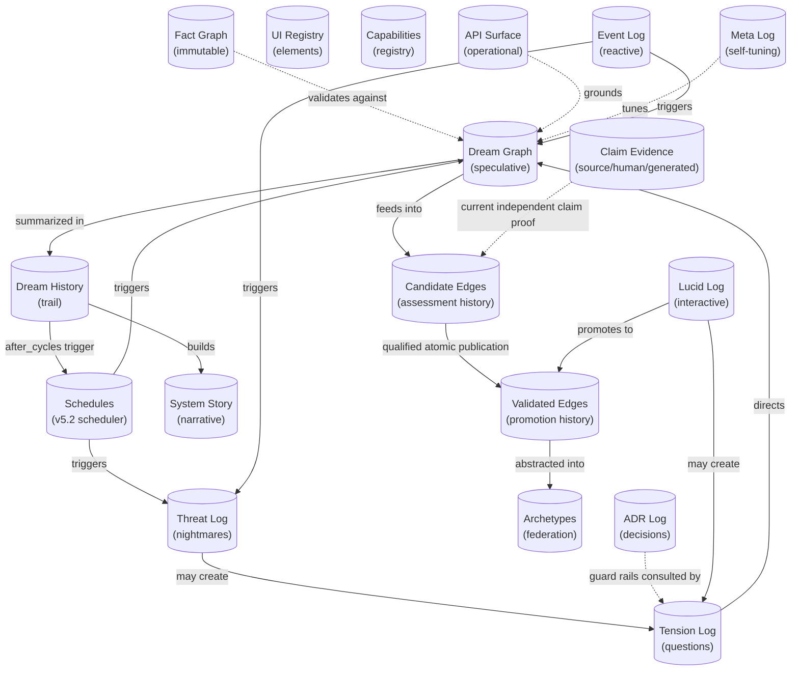

# DreamGraph Data Model

The in-progress Slice 25 execution journal adds backward-compatible `approval_reviews` metadata: original review ID, context receipt/revision, policy revision, time and tool/scope/argument hashes. It contains no worker credential or raw approval arguments. Existing records default to an empty review list. Publication of a review does not attest an active grant after expiry or restart. Baseline 14 reviews the additive canonical request; actual HTTP/core recovery checks pass. Operator UI and ordinary-loop adoption remain open. See [client integration](ashoka/client-integration.md).

The registered `plan_state.json` metadata store now has a typed authority format under implementation: `dreamgraph.plan_authority.v1` contains v2 plan workflow records, original Markdown/log backups, typed event history and one materialized projection. It publishes through the existing journal and does not advance graph currency. [C14 details and rollout limits](ashoka/plan-authority.md) distinguish schema-readable v1 records from governed v2 transitions; no legacy completion prose is automatically imported.

> Persistent store schemas and relationships. Ashoka's reviewed physical-format inventory is in [the foundation baseline](../tests/fixtures/ashoka/baseline.json).

---

The physical registry names **39 stores: 21 graph and 18 metadata**. Dynamic, immutable outcome artifacts are not additional named stores. The reviewed format inventory and registry govern optional bootstrap absence and compatibility.

## Store Relationship Map

---

## Cognitive Stores

### Dream Graph (`dream_graph.json`)

The primary speculative memory store. Contains hypothetical nodes and edges generated during REM cycles.

**Behavior:** Grows during REM, shrinks during normalization and decay. Deduplication via normalized keys (sorted `from|to` + base relation).

| Field | Type | Description |
|-------|------|-------------|
| `nodes[]` | DreamNode[] | Hypothetical entity representations |
| `nodes[].id` | string | Entity name |
| `nodes[].hypothetical` | boolean | Always `true` |
| `nodes[].domain` | string | Inferred domain |
| `nodes[].confidence` | number | 0.0–1.0, decays each cycle |
| `nodes[].ttl` | number | Cycles until expiry (default 8) |
| `edges[]` | DreamEdge[] | Speculative relationships |
| `edges[].from` | string | Source entity ID |
| `edges[].to` | string | Target entity ID |
| `edges[].relation` | string | Relationship type (e.g. `may_depend_on`) |
| `edges[].confidence` | number | Combined score, decays by 0.05/cycle |
| `edges[].plausibility` | number | Domain coherence score |
| `edges[].evidence` | number | Grounding evidence score |
| `edges[].evidence_count` | number | Independent evidence sources |
| `edges[].contradiction` | number | Conflict score (max 0.3 for promotion) |
| `edges[].strategy` | string | Origin strategy |
| `edges[].ttl` | number | Cycles until expiry |
| `edges[].reinforcement_count` | number | Times re-generated (dedup counter) |
| `edges[].generated_at` | number | Cycle when first created |
| `edges[].status` | string | `candidate` \| `latent` \| `validated` \| `rejected` |

**Relationships:** Feeds into `candidate_edges_store`, promotes to `validated_edges_store`, validated against `fact_graph`.

---

### Candidate Edges (`candidate_edges.json`)

Append-only log of all normalization judgments. Never truncated — grows monotonically.

| Field | Type | Description |
|-------|------|-------------|
| `id` | string | Unique identifier |
| `from` | string | Source entity |
| `to` | string | Target entity |
| `relation` | string | Relationship type |
| `outcome` | string | `validated` \| `latent` \| `rejected` |
| `scores` | object | Full breakdown: plausibility, evidence, contradiction, confidence |
| `cycle` | number | Normalization cycle number |

---

### Validated Edges (`validated_edges.json`)

Edges that passed the promotion gate. Generally stable and growing.

**Promotion criteria:** confidence ≥ 0.62, plausibility ≥ 0.45, evidence ≥ 0.40, evidence_count ≥ 2, contradiction ≤ 0.3.

| Field | Type | Description |
|-------|------|-------------|
| `from` | string | Source entity |
| `to` | string | Target entity |
| `relation` | string | Cleaned relationship (no speculative qualifiers) |
| `confidence` | number | Combined confidence at promotion time |
| `promoted_at` | number | Cycle number |
| `strategy` | string | Original dream strategy |

---

### Tension Log (`tension_log.json`)

All tensions: unresolved questions, inconsistencies, discovered gaps. Active cap of **200** prevents cognitive overload while allowing rich autonomous exploration. Resolved tensions are archived, not deleted.

| Field | Type | Description |
|-------|------|-------------|
| `id` | string | UUID |
| `description` | string | Human-readable description |
| `type` | string | `missing_link` \| `weak_connection` \| `hard_query` \| `ungrounded_dream` \| `code_insight` |
| `urgency` | number | 0.0–1.0, decays by 0.01/cycle |
| `domain` | string | One of 11 domains: security, invoicing, sync, integration, data_model, auth, payroll, reporting, api, mobile, general |
| `entities` | string[] | Related entity IDs |
| `ttl` | number | Cycles until auto-expiry (default 30) |
| `created_at` | number | Cycle when recorded |
| `resolved` | boolean | Whether closed |
| `resolution.type` | string | `confirmed_fixed` \| `false_positive` \| `wont_fix` |
| `resolution.authority` | string | `human` \| `system` |
| `resolution.cycle` | number | When resolved |
| `attempted` | boolean | At least one resolution candidate has been validated and escalated. Prevents the resolver from re-proposing the same strategy on every cycle |
| `resolution_candidate` | object? | Pending resolution proposal awaiting validation. Removed when the tension resolves or after escalation |
| `resolution_candidate.strategy` | string | `merge` \| `mediator` \| `split` \| `reframe` \| `wont_fix` |
| `resolution_candidate.rationale` | string | Why this strategy was chosen |
| `resolution_candidate.proposed_at` | string | ISO timestamp of the proposer pass that created the candidate |
| `resolution_candidate.validation_window` | number | Dream cycles remaining before the candidate is judged. Decremented by `validateResolutionCandidates` each cycle |
| `resolution_candidate.source` | string | `heuristic` \| `llm` |
| `resolution_candidate.proposed_action` | object? | v8.2.6. Concrete follow-up: an `enrich_seed_data` payload (graph-enrichment plans) or a `resolve_tension` call (wont_fix / source-change plans). Auto-executed when `DREAMGRAPH_AUTO_APPLY_RESOLUTION_PLANS=1` |

---

### Explorer Audit Log (`explorer_audit.jsonl`)

JSONL append-only ledger of every curated mutation issued through the Explorer
SPA's `POST /explorer/mutations/{intent}` funnel. Slice 2 covers
`tension.resolve`, `candidate.promote`, and `candidate.reject`. **Every
mutation — successful, failed, or dry-run — produces exactly one row.** The
daemon emits an `audit.appended` event on the in-process bus immediately after
each append, which the EventDock surfaces in real time.

One row per line, JSON object:

| Field | Type | Description |
|-------|------|-------------|
| `mutation_id` | string | UUIDv4 generated server-side; returned to the caller |
| `timestamp` | string | ISO-8601 timestamp at append time |
| `actor` | string | Instance UUID of the caller (from `X-DreamGraph-Instance`) |
| `intent` | string | Wire name of the mutation (e.g. `tension.resolve`) |
| `affected_ids` | string[] | Entity / edge / tension ids the mutation touched |
| `reason` | string | Required non-empty justification supplied by the caller |
| `before_hash` | string \| null | sha-256 hex of the subject before the handler ran |
| `after_hash` | string \| null | sha-256 hex of the subject after; equals `before_hash` for dry-run |
| `etag` | string \| null | Snapshot etag observed *after* the mutation (for replay/audit) |
| `dry_run` | boolean | `true` when rehearsed via `X-DreamGraph-Dry-Run: 1` or `body.dry_run: true` |
| `ok` | boolean | Whether the mutation succeeded |
| `error` | string? | Short error code on failure (`etag_mismatch`, `not_found`, …) |
| `message` | string? | Human-readable error message on failure |

Preconditions enforced before any row is written:

- `If-Match` header is **mandatory** for the three real intents. Missing → 400 `missing_if_match`. Stale → 412 `etag_mismatch` (and a failure row is recorded).
- `body.reason` is **mandatory** and must be a non-empty string. Missing → 400 `missing_reason`.
- Auth must succeed (`X-DreamGraph-Instance` matches the active scope). 401/403 responses do **not** produce audit rows.

---

### Dream History (`dream_history.json`)

Append-only audit trail of every cycle. Never modified, only appended.

| Field | Type | Description |
|-------|------|-------------|
| `cycle` | number | Monotonically increasing |
| `phase` | string | `dream` \| `nightmare` |
| `dreams` | number | Edges generated |
| `promoted` | number | Edges promoted |
| `latent` | number | Edges kept as speculative memory |
| `rejected` | number | Edges discarded |
| `expired` | number | Edges decayed away |
| `strategies` | object | Strategy → count map |
| `tensions_active` | number | Active tension count at cycle end |
| `timestamp` | string | ISO timestamp |

---

### Threat Log (`threat_log.json`)

Output from NIGHTMARE adversarial scans.

| Field | Type | Description |
|-------|------|-------------|
| `from` | string | Attack surface / vulnerable component |
| `to` | string | Affected resource / data |
| `threat_type` | string | `privilege_escalation` \| `data_leak_path` \| `injection_surface` \| `missing_validation` \| `broken_access_control` |
| `severity` | string | `critical` \| `high` \| `medium` \| `low` |
| `cwe_id` | string | CWE identifier (e.g. CWE-269) |
| `description` | string | Threat description |
| `blast_radius` | string[] | Potentially affected entities |
| `cycle` | number | Discovery cycle |

---

### Archetypes (`dream_archetypes.json`)

Anonymized patterns for cross-project federation.

| Field | Type | Description |
|-------|------|-------------|
| `id` | string | Unique archetype ID |
| `pattern_type` | string | `security_pattern` \| `structural_gap` \| `cross_domain_bridge` \| `tension_resolution` \| `symmetry_pattern` \| `reinforcement_pattern` \| `causal_pattern` \| `generic_connection` |
| `from_role` | string | Anonymized source role (e.g. `auth_component`) |
| `to_role` | string | Anonymized target role |
| `relation` | string | Abstracted relationship |
| `confidence` | number | Confidence at extraction time |
| `source_system` | string | Anonymized origin identifier |

---

## Documentation Stores

### ADR Log (`adr_log.json`)

Append-only Architecture Decision Records.

| Field | Type | Description |
|-------|------|-------------|
| `id` | number | Sequential ADR number |
| `title` | string | Decision title |
| `status` | string | `accepted` \| `deprecated` \| `superseded` |
| `context` | string | Problem statement |
| `decision` | string | What was decided |
| `alternatives` | string[] | Considered alternatives |
| `consequences` | string[] | Known consequences |
| `guard_rails` | string[] | Constraints that must be preserved |
| `entities` | string[] | Related entity IDs |
| `tags` | string[] | Classification tags |
| `date` | string | ISO date |

---

### UI Registry (`ui_registry.json`)

Semantic UI element definitions across platforms. Supports merge-on-update and platform gap detection. As of **v10.2.0** UI elements are first-class graph citizens: entries with a non-empty `source_repo` are indexed in `index.json` alongside features/workflows/data_model and are eligible for autonomous LLM enrichment via `enrich_parser_nodes` (target `ui` / `all`). The `source_repo` field is the provenance gate — manual entries without `source_repo` remain in the registry but are intentionally excluded from the canonical graph index.

As of **v10.3.0** (slice 2) `ui_registry.json` is also populated by the native UI scanner: `scan_project target:"ui"` walks `.tsx/.jsx/.vue/.svelte/.razor/.xaml` files and inserts scanner-origin entries via `applyScannerUiElements`. The merge preserves entries with `source_kind` of `manual`, `sdk`, `user_guidance`, or `generated` (the scanner never overwrites them) and preserves enrichment fields on existing scanner-origin entries across re-scans.

| Field | Type | Description |
|-------|------|-------------|
| `id` | string | Unique element ID (kebab-case) |
| `name` | string | Display name |
| `category` | string | `data_display` \| `data_input` \| `navigation` \| `feedback` \| `layout` \| `action` \| `composite` |
| `purpose` | string | Semantic purpose (role tag — preserved across enrichment) |
| `features` | string[] | Related feature IDs |
| `data_contract` | object | Input/output/events specification |
| `interaction_model` | string[] | `hover` \| `click` \| `drag` \| `keyboard` \| `touch` \| `swipe` |
| `platforms` | object | `{ web: {...}, ios: {...}, android: {...} }` |
| `source_repo` | string? | Repository the element originated from. **Indexing/enrichment gate.** |
| `source_file` | string? | Path of the source file the element was extracted from. |
| `source_kind` | string? | `scanner` \| `manual` \| `sdk` \| `user_guidance` \| `generated`. Descriptive only. |
| `evidence_refs` | string[]? | Supporting file paths / anchors. |
| `intent` | string? | High-level intent (auto-populated by enrichment). |
| `description_raw` | string? | Original raw description prior to enrichment rewrite. |
| `enrichment` | object? | `{ enriched, enriched_at, enricher, model?, confidence? }` — same shape as features/data_model. |
| `links` | GraphLink[]? | Cross-graph links (`feature`, `workflow`, `data_model`, `capability`, `datastore`, `ui_element`). |

---

## Foundation Stores

### Fact Graph (`data/*.json`)

The immutable knowledge base — **never modified by the cognitive system**. Written only by the enrichment script or manual population.

| File | Content |
|------|---------|
| `system_overview.json` | Project description, architecture overview |
| `features.json` | Feature entities with cross-links (GraphLink[]) |
| `workflows.json` | Operational workflows with steps, triggers, actors |
| `data_model.json` | Data entity definitions with key fields, relationships |
| `auxiliary_entities.json` | Project entities discovered by `scan_project` that are *not* features/workflows/data_model: test suites, configuration files, automation scripts, registered MCP tools |
| `index.json` | Entity ID → resource URI lookup |

#### Enrichment fields (v10.1, extended in v10.2 to cover UI registry)

`Feature`, `DataModelEntity`, and (as of v10.2) `SemanticElement` (UI registry) entries support additive optional fields written by `enrich_parser_nodes`:

| Field | Type | Description |
|-------|------|-------------|
| `intent` | string? | Why the entity exists / problem it solves |
| `purpose` | string? | Short tag for primary role (e.g. `service-locator`, `configuration`). For UI elements this field is **preserved**, not overwritten — the UI's own purpose already serves as the role tag. |
| `description_raw` | string? | Original parser-generated description preserved before the LLM rewrote `description` |
| `enrichment.enriched` | boolean | `true` once enriched |
| `enrichment.enriched_at` | string | ISO timestamp |
| `enrichment.enricher` | string | Tool identity (e.g. `enrich_parser_nodes/1.1`) |
| `enrichment.model` | string? | LLM model name |
| `enrichment.confidence` | number? | 0..1 self-reported confidence |

Existing readers that ignore these fields continue to work unchanged.

#### Provenance fields (v10.4)

`Feature`, `Workflow`, and `DataModelEntity` entries also support optional provenance metadata used by the canonical promotion gate (see [docs/cognitive-engine.md](cognitive-engine.md#canonical-promotion-provenance)):

| Field | Type | Description |
|-------|------|-------------|
| `provenance_kind` | `"source_backed" \| "human_asserted" \| "derived_hub"` | How this entity earned its place in the canonical graph. |
| `human_asserted` | boolean? | `true` when a human explicitly asserted this entity (no source files required). |
| `derived_from_node_ids` | string[]? | For `derived_hub` entities: ids of grounded supports the hub derives from. |
| `source_repo` | string \| string[]? | Repo(s) that own this entity. Required for promotion via any path. |
| `source_files` | string[]? | Source-file evidence for `source_backed` entities. |

The promotion gate blocks dreams that have no `source_repo`, no `source_files`, are not `human_asserted`, and whose `derived_from_node_ids` chain does not reach grounded supports. The `quarantine_source_less_facts` MCP tool retroactively enforces the same invariant.

### Auxiliary Entities (`auxiliary_entities.json`)

Populated by `scan_project` during Phase 2.5 (after LLM enrichment, before index rebuild). Each entry classifies a single project file by `kind`:

- `test_suite` — files matching `*.test.*`/`*.spec.*` or under `tests/`, `test/`, `__tests__/`, `spec/`, `specs/`, `e2e/` directories
- `configuration` — `package.json`, `tsconfig*.json`, `pyproject.toml`, `*.config.*`, `.env*`, `.eslintrc*`, `.prettierrc*`, `.editorconfig`, `.npmrc`, `.nvmrc`, `*.toml`, `*.ya?ml`, `*.ini`, etc.
- `automation_script` — `*.sh`, `*.ps1`, `*.bat`, `*.cmd`, `Makefile`, `Dockerfile`, `docker-compose*.yml`, files under `scripts/`/`bin/`, GitHub Actions workflows
- `mcp_tool` — TypeScript/JavaScript modules under `src/tools/`. Tool names are extracted from `server.tool("name", ...)` and `registerXTool(...)` patterns within the first 8 KB of each file

Classification follows a strict priority (tests → mcp_tool → automation_script → configuration); a file matches at most one kind.

| Field | Type | Description |
|-------|------|-------------|
| `metadata.description` | string | Free-text purpose |
| `metadata.schema_version` | string | Currently `"1.0.0"` |
| `metadata.last_scanned` | string | ISO timestamp of the most recent merge |
| `metadata.total` | number | Total entries after merge |
| `entries[].id` | string | Stable id of form `<kind>_<sanitized_name>` |
| `entries[].kind` | string | `test_suite` \| `configuration` \| `automation_script` \| `mcp_tool` |
| `entries[].name` | string | Display name |
| `entries[].uri` | string | Resource URI: `<kind>://<id>` (mcp_tool uses `tool://<tool_name>`) |
| `entries[].source_files` | string[] | Files contributing to the entity (multiple when ids collide) |
| `entries[].source_repo` | string | Repo name from the originating scan |
| `entries[].tags` | string[]? | Optional classification tags |
| `entries[].meta` | object? | Optional kind-specific metadata |

Index integration: each auxiliary entry is added to `index.json` as `{ type: <kind>, uri, name, source_repo }`, exposing the four new entity types alongside features/workflows/data_model.

### Capabilities Registry (`capabilities.json`)

MCP capability declarations — all tools and resources with schemas.

| Field | Type | Description |
|-------|------|-------------|
| `tools` | Tool[] | MCP tool declarations |
| `resources` | Resource[] | MCP resource declarations |

---

## v5.1: System Story (`system_story.json`)

Persistent, auto-accumulated narrative. Survives restarts.

| Field | Type | Description |
|-------|------|-------------|
| `chapters[]` | Chapter[] | Auto-generated every 10 cycles |
| `chapters[].title` | string | Chapter title |
| `chapters[].cycle_range` | [number, number] | Cycles covered |
| `chapters[].body` | string | Narrative text |
| `chapters[].stats` | object | Validated, rejected, tensions |
| `weekly_digests[]` | Digest[] | Aggregate summaries |
| `weekly_digests[].health_trend` | string | Overall trend analysis |

---

## v5.2: Schedules (`schedules.json`)

Persistent store for the Dream Scheduler. All active and completed schedules with full execution history. Survives restarts — active schedules resume automatically on startup.

### Schedule Object

| Field | Type | Description |
|-------|------|-------------|
| `id` | string | Unique ID (e.g. `sched_1775322785274_jcs3zm`) |
| `label` | string | Human-readable name |
| `action` | string | `dream_cycle` \| `nightmare_cycle` \| `normalize_dreams` \| `metacognitive_analysis` \| `get_causal_insights` \| `get_temporal_insights` \| `export_dream_archetypes` |
| `trigger_type` | string | `interval` \| `cron_like` \| `after_cycles` \| `on_idle` |
| `trigger_config` | object | Trigger-specific parameters (see below) |
| `action_params` | object | `{ strategy?, max_dreams? }` |
| `enabled` | boolean | Whether the schedule is active |
| `status` | string | `active` \| `paused` \| `completed` \| `error` |
| `max_runs` | number \| null | Total executions before auto-disable (null = unlimited) |
| `run_count` | number | Executions completed so far |
| `error_streak` | number | Consecutive failures (auto-pauses at 3) |
| `last_run_at` | string \| null | ISO timestamp of last execution |
| `next_run_at` | string \| null | Projected next execution time |
| `created_at` | string | ISO timestamp |

### Trigger Config Variants

| Trigger Type | Config Fields |
|-------------|--------------|
| `interval` | `{ interval_seconds: number }` |
| `cron_like` | `{ hour: number, minute: number, days_of_week: number[] }` |
| `after_cycles` | `{ every_n_cycles: number, cycles_since_last: number }` |
| `on_idle` | `{ idle_seconds: number }` |

### Execution Record

| Field | Type | Description |
|-------|------|-------------|
| `schedule_id` | string | Parent schedule ID |
| `executed_at` | string | ISO timestamp |
| `trigger_type` | string | Trigger that fired |
| `action` | string | Action executed |
| `success` | boolean | Whether it completed without error |
| `result_summary` | string | Brief outcome description |
| `duration_ms` | number | Execution time |
| `error` | string \| null | Error message if failed |

---

## v5.2: Lucid Log (`lucid_log.json`)

Archive of interactive lucid dream sessions. Each session records the original hypothesis, exploration findings, confidence scores, and which edges were accepted or rejected by the human operator.

### Root Object

| Field | Type | Description |
|-------|------|-------------|
| `sessions[]` | LucidSession[] | All completed lucid dream sessions |
| `metadata.created` | string | ISO timestamp of log creation |
| `metadata.lastUpdated` | string | ISO timestamp of last session write |

### LucidSession

| Field | Type | Description |
|-------|------|-------------|
| `id` | string | Unique session identifier (`lucid-<timestamp>`) |
| `hypothesis` | LucidHypothesis | Parsed hypothesis with subject, predicate, object, scope |
| `findings` | LucidFindings | Exploration results: supporting signals, contradicting signals, gaps |
| `confidence` | number | System-assessed confidence (0–1) |
| `outcome` | string | `accepted` \| `rejected` \| `refined` \| `abandoned` |
| `acceptedEdges` | number | Count of edges promoted to validated_edges.json |
| `startedAt` | string | ISO timestamp of session start |
| `endedAt` | string | ISO timestamp of session end |

---

## v6.2: API Surface (`api_surface.json`)

Operational layer store for extracted programmatic API surfaces. Populated by `extract_api_surface`, queried by `query_api_surface`, served as `ops://api-surface` resource. Used by the grounding pipeline to enrich cognitive dreams with structured class/method knowledge.

### Root Object

| Field | Type | Description |
|-------|------|-------------|
| `extracted_at` | string | ISO timestamp of last extraction |
| `repo_root` | string | Absolute path to the repository root |
| `modules[]` | ApiModule[] | One module per source file |

### ApiModule

| Field | Type | Description |
|-------|------|-------------|
| `file_path` | string | Relative path from repo root (forward slashes) |
| `module_name` | string | Dot-separated module name (e.g. `src.tools.api-surface`) |
| `language` | string | `typescript` \| `javascript` \| `python` \| `csharp` |
| `classes[]` | ApiClass[] | Classes and interfaces extracted from this file |
| `functions[]` | ApiFreeFunction[] | Module-level functions |
| `platform` | string \| null | Optional platform tag (e.g. `python-port`) |
| `provenance` | Provenance | Extraction metadata |

### ApiClass

| Field | Type | Description |
|-------|------|-------------|
| `name` | string | Class/interface name |
| `bases` | string[] | Base classes / interfaces |
| `methods[]` | ApiMethod[] | Methods with full signatures |
| `properties[]` | ApiProperty[] | Properties with types |
| `decorators` | string[] | Class-level decorators/attributes |
| `file_path` | string | Source file path |
| `line_number` | number | Line where class is declared |

### ApiMethod

| Field | Type | Description |
|-------|------|-------------|
| `name` | string | Method name |
| `parameters[]` | ApiParam[] | Parameters with types and defaults |
| `return_type` | string \| null | Return type annotation |
| `signature_text` | string | Full human-readable signature |
| `is_static` | boolean | Static method flag |
| `is_async` | boolean | Async method flag |
| `visibility` | string | `public` \| `protected` \| `private` |
| `line_number` | number | Line number in source |
| `decorators` | string[] | Method-level decorators |
| `defined_in` | string \| null | Origin class for inherited methods |

### Provenance

| Field | Type | Description |
|-------|------|-------------|
| `kind` | string | `extracted` \| `pattern_inference` \| `manual` |
| `source_files` | string[] | Files that contributed to this data |
| `extracted_at` | string | ISO timestamp of extraction |

---

## v5.1: Meta Log (`meta_log.json`)

Audit trail of metacognitive self-analysis. Every `metacognitive_analysis` run appends an entry documenting strategy performance, calibration measurements, and any auto-applied threshold adjustments. Served via the `dream://metacognition` resource.

| Field | Type | Description |
|-------|------|-------------|
| `timestamp` | string | ISO timestamp of analysis |
| `cycle` | number | Current dream cycle at time of analysis |
| `mode` | string | `strategy_performance` \| `promotion_calibration` \| `domain_decay` |
| `findings` | object | Mode-specific analysis results |
| `recommendations` | object[] | Threshold adjustment recommendations |
| `auto_applied` | boolean | Whether recommendations were auto-applied |
| `safety_guards` | object | Min/max bounds that were enforced |

---

## v5.1: Event Log (`event_log.json`)

Append-only log of cognitive events dispatched through the event router. Each event records the source, classification, entity scope, recommended action, and execution outcome. Served via the `dream://events` resource.

| Field | Type | Description |
|-------|------|-------------|
| `id` | string | Unique event identifier |
| `source` | string | `git_webhook` \| `ci_cd` \| `runtime_anomaly` \| `tension_threshold` \| `federation_import` \| `manual` |
| `severity` | string | `low` \| `medium` \| `high` \| `critical` |
| `entities` | string[] | Affected entity IDs (resolved from event payload) |
| `recommended_action` | string | Cognitive action recommended (e.g. `dream_cycle`, `nightmare_cycle`) |
| `action_taken` | boolean | Whether the recommended action was executed |
| `result_summary` | string | Brief outcome description |
| `timestamp` | string | ISO timestamp |
<!-- CONTINUATION TEST SLICE 4 -->
## Incremental scan state and evidence lifecycle

`scan_state.json` uses schema `dreamgraph.scan_state.v1`. It records the independent source-scan revision, repository snapshots, content hashes, ignore/Git basis, covered targets, and the structural evidence ledger. Structural claims use stable semantic keys and explicit supporters rather than timestamps or line numbers. In Ashoka, `publication_state.json` is the final durable publication marker; the source-scan store participates in that transaction. See [publication and recovery](ashoka/foundation.md#publication-and-recovery) for receipt, journal and compatibility semantics.

Source-derived lifecycle values are `active`, `stale_candidate`, `deprecated`, `orphaned`, and `purge_eligible`. Incremental reconciliation withdraws individual supporters, preserves independently supported claims and governed/non-source fields, and deprecates unsupported claims without automatic purge. Derived hubs are evaluated from grounded contributor IDs; datastore, ADR, plan, schedule, tension, plugin, manual, and protected UI knowledge is outside source-deletion authority.

## Ashoka canonical graph and publication metadata

The [canonical schema artifact](contracts/graph-contracts.v1.json) separates stable identities, literal payloads, assertion classes, confidence, evidence origin/ancestry, endpoints, completeness/freshness and revision vectors. Repository-local IDs have an explicit namespace. Unknown confidence and historical timestamps stay null. Malformed stores and ambiguous references are scoped limitations, rather than empty success or synthesized facts.

`publication_state.json` uses `dreamgraph.publication.v1`: epoch, publication/domain/graph revisions, independent currency, committed store hashes, receipts and notification outbox. `last_graph_mutation_at` advances only for a successful graph-changing publication; no-op, checkpoint-only, retry and rolled-back operations do not advance it. `last_full_scan_at` and scoped source-reconciliation metadata are separate. Their age never defines graph staleness.

`reconciliation_journal.json` uses `dreamgraph.reconciliation_journal.v2`. Recovery rolls back before the receipt-bearing marker and rolls forward after it. Previous v1 is supported with its original rollback behavior. Both files belong to the daemon publication/recovery authority; ordinary writers cannot edit them. [Foundation status](ashoka/foundation.md) distinguishes primitives from unqualified consumers and migration work.

Ashoka configuration backups and prepared/terminal apply receipts use `config/.engine-config/<file-identity>/<operation-hash>.json`. They contain private before/after settings, are excluded from graph/model resources, and support revision-aware recovery/undo. They are configuration authority records, not additional graph entity families. See [configuration persistence](ashoka/configuration.md).

### Private session authority metadata and cognitive attribution

`session_authority.json` (`dreamgraph.session_authority.v1`) contains instance/revision, session ID/principal/token hash/expiry/preferences, finite confirmation challenges, and canonical scoped grants with two confirmations/expiry/revocation. It is publication-owned private metadata, not an additional graph family. Bearer secrets are never stored. It does not advance last graph mutation time. Limits and recovery are documented in [session authority](ashoka/session-authority.md); legacy unowned private histories are not implicitly reassigned.

Dream nodes, edge metadata and semantic validation records optionally carry `dreamgraph.cognitive_provenance.v1`: prompt/schema versions/hashes, exact supplied context hash, source/ancestry IDs, immutable role policy fingerprint, provider/requested/reported model/API/adapter/effort/retention, elapsed/response hash and actual admission telemetry. Existing rows remain valid without invented historical provenance; this does not create independent evidence or change assertion class. [Offline protocol and baseline](ashoka/cognitive-policy-evaluation.md) retain original output and unmeasured cost/model-quality fields.

`normalization_evidence.json` (`dreamgraph.normalization_evidence.v1`) retains exact typed claims, immutable observations, source proofs, ancestry and withdrawal records. Original observations and operation receipts survive revocation. [Claim evidence](ashoka/normalization-evidence.md) defines its source/human/generated distinctions and finite bounds; Slice 15 qualification is in progress.

### Claim evidence and full normalization outcomes

`normalization_evidence.json` uses `dreamgraph.normalization_evidence.v1`: exact typed `claim`, directed verdict, immutable observation ID, origin, parents, source proof, operation ID and observation time. Separate withdrawals retain observation IDs and reasons. A source proof binds repository/path, SHA-256, JSON pointer and producer-assigned independence. It is accepted only by the internal qualified decoder and publication receipt.

`normalization-result-<operation-sha256>.json` retains one full pass outcome. A small C04 receipt binds actor, operation, artifact filename/hash and affected participants. Candidate history is retained; the canonical graph projects the latest assessment for each typed `edge:<dream-id>` or `node:<dream-id>` candidate. Same-cycle duplicates remain errors. Promotions are history, not permanent current trust. Source/claim/evidence dependencies and unresolved managed effects determine present applicability, including real paths behind repository aliases.

Ashoka Slice 14 [persistent strategy learning](ashoka/strategy-learning.md) stores post-dedup observations and reviewed usefulness in existing `meta_log.json`, with atomic dream/learning publication and explicit fixed-allocation recovery. Source owners include `src/cognitive/strategy-portfolio.ts` and `src/cognitive/dream-deduplication.ts`; repeated generation is neither evidence nor labeled accuracy. Qualification is pending.

Ashoka Slice 16 [curation and retention](ashoka/curation-retention.md) adds append-only dispositions to existing `graph_maintenance.json` and reversible hash-bound archives. The source owner is `src/cognitive/curation.ts`. Reject/retire/reopen, dream decay and quarantine share the graph publication writer; human acceptance remains a human assertion and assessment history is preserved. `mutate_validated_edge` now requires `reason` and `expected_revision` and accepts `operation_id`/`dry_run`; retarget creates a proposal requiring revalidation. Qualification is pending.

## jobs.json execution owner (Slice 17)

The existing registered metadata store holds `dreamgraph.jobs.v1`: instance, revision and bounded job records. Each embeds the canonical `dreamgraph.job.v1`, immutable action/version/parameters, role-policy and tariff references (no credentials), parent budget, conflict lanes, process lease and original bounded outcome. No new named store is introduced. `spend_ledger.json` runs carry optional `parent_run_id` (legacy runs load as null); all child attempts are charged against the shared parent and their own role ceilings. Running jobs recovered after restart become recovery-required rather than redispatched. Qualification and producer adoption are in progress.

`schedules.json` v2 metadata adds revision and last activity; definitions add `definition_revision`, action version, timezone/fold/missed/overlap policy and archive timestamp. Immutable canonical occurrence plus definition snapshots, original executions, definition history and payload-bound operation receipts survive edits and archive. Reads parse legacy valid definitions with explicit UTC policy and reject malformed stores; invalid action parameters block dispatch. Capacity requires archival, rather than silently deleting history. `graph_maintenance.json.digestion` embeds bounded staged records; source roots remain in `change_obligations.json`. Reconciliation accepts only exact current source hashes or a verified contiguous chain of managed edits. Each stage pins generation/fingerprint/affected identities; completing G cannot clear G+1. Job outcomes larger than 64 KiB use atomic hash-bound `job-result-<sha>.json` artifacts up to the 8 MiB machine boundary. These archives are not additional named stores.

Slice17 job records additionally retain work_settled and bounded external_effects (dispatch intent, endpoint/payload hash, acknowledgement or uncertainty and receipt). This separates response acknowledgement from local termination. The jobs file keeps payload-bound cancel_receipts; these receipts do not authorize another dispatch. Large original results stay in published hash-bound artifacts. Existing webhook subscription/dead-letter owners use the common writer and verified reads, with capacity backpressure instead of deleting oldest accepted failures. Existing bootstrap fingerprint history records pending_admission without paid work and fails closed on unavailable published history.

### Ashoka temporal/causal/federation encodings

Existing temporal_graph.json and causal_graph.json owners use dreamgraph.temporal_observations.v1 and dreamgraph.correlation_hypotheses.v1. Existing dream_archetypes.json uses dreamgraph.federation_store.v2 with origin hypotheses, import receipts, export manifests and bounded quarantine history. Read-only views omit original quarantined bytes. Fixed-vocabulary v2 exchange artifacts are manifests, not new graph stores. Legacy local v1 requires reviewed migration. See [evidence contract](ashoka/temporal-federation.md).

### Risk lifecycle fields (Slice 19)

The existing tension_log.json owns stable risk_key, per-risk revision, observation fingerprint, proposal/event history, explicit resolution_state and retained reappearance/verification data. metadata.revision detects stale whole-store writes. expired_unverified is a retirement disposition, not correctness evidence. No new persistence owner is introduced.

Ashoka Slice20 is verified at its declared core handoff: narrative/playback/lifecycle views consume a revision-bound derived source context and separate historical counts from current proof. Story history is retained in archived_chapters/archived_digests; missing/corrupt published history fails closed. Lucid exploration has a finite session-owned existing engine job lease and durable lucid_log.json intent/actions/recovery. Human acceptance records a rationale and human_assertion with zero independent roots, never inflated confidence or source verification. No source/provider/user wait occurs under the writer. See docs/ashoka/lifecycle-narrative.md and wave-20-22-verification.json for qualification and consumer limits.
# Ashoka surface projections

Slice25 adds `execution_contexts.json` (`dreamgraph.execution_contexts.v1`) as registered non-graph execution metadata. Entries retain principal/session/execution identity, strict context query, whole canonical pack/receipt, affected-input and named-source hashes, unresolved named-source gaps, prompt hash, monotonic record revision, exact delivery state, bounded effect observations and existing change-obligation IDs. `assembled`/`running` are distinct from `no_change`, `state_committed`, `graph_committed`, `work_pending`, `reconciliation_pending` and `recovery_required`. Effects distinguish actual graph receipts from operational-state receipts; closure validates their execution scope and physical store domain. An unsettled execution-owned job prevents terminal closure. Capacity is 1,024 entries/16 MiB; overflow requires archival rather than lost receipts. Host delivery attests injection, not model understanding; exact acknowledgement retries are idempotent. Source command observation uses repository intent followed by exact changed paths; `failed` on that obligation is the existing no-source-effect recovery disposition when the observed scope is unchanged. External effects remain unattested. Pending closure can recover a later committed reconciliation without repeating the effect. Qualification/recovery/client adoption remain in progress; see [client integration](ashoka/client-integration.md).

Explorer v2 is a derived, bounded canonical view, not a new graph store. Typed `identity`, `assertion_class`, current provenance, revision/currency, render scope, `canonical_state`, ETag and drawable `render_key` accompany nodes/relationships. Unknown recorded confidence stays unknown in inspection; a renderer's neutral scalar is not evidence. Schedule workspace responses read existing `schedules.json`, `jobs.json` and dirty partitions at one stable revision; no new scheduling persistence owner is introduced. See [Explorer](ashoka/explorer-evidence.md) and [schedules](ashoka/schedule-workspace.md).

The execution index also retains up to 128 immutable archive descriptors: exact file/hash, original execution IDs and archive time. Each `execution-context-archive-<sha256>.json` (`dreamgraph.execution_context_archive.v1`) contains up to 128 complete settled records/16 MiB. Moving records and publishing the index occur in one journaled commit. Archived context remains owner/session bound and hash checked; IDs remain reserved. Unknown/pending work cannot be archived as settled or evicted to make space. New-instance schedule fallback and default template use the canonical v2 empty document; existing legacy schedule conversion remains a reviewed migration.

Each execution retains bounded whole `model_reports` and separate `native_stop_observations` (up to128 each). A model report is saved before acknowledgment and cannot change on retry or restart. The original host's independently observed stop is bound to its original request/attempt and records the acknowledged original attempt set in `native_stop_recovery`; it creates no new model permit. Plan-bound recovery also requires the committed original C14 stop-recovery command. These private metadata fields preserve the first report/closure and unknown effect history while allowing the effective stopped state to converge. Unknown usage remains conservative liability; unrelated source uncertainty and obligations are still pending. Missing historical reports remain unavailable rather than being reconstructed from ledger acknowledgment.

Explicit native plan tasks add optional private fields to an execution entry: `plan_execution` pins the C14 instance/project/plan, task kind, slice, reviewed revision/definition and approval; `plan_source` retains the original physical Markdown identity/hash; `plan_closure` records the first requested/effective termination and exact C14 end command before publishing it. Existing entries remain readable. These fields do not create another plan lifecycle writer. Public managed snapshots expose only the task intent and shared effective C14 state; private source paths and closure commands stay out of model context and browser chat provenance. A context-only plan selection creates none of these execution fields. Baseline17 adds the explicit intent contract and optional snapshot projection (42 generated schemas), preserving all frozen tasks, owners and evidence.

A private closure command may be null only for proven zero dispatch: the original context is still assembled and undelivered, has no effects, and its C14 scope has no execution lease. This lets a rejected admission close without inventing an implementation attempt or retaining an uncloseable context. It does not release an admitted or uncertain native job. The first requested/effective disposition remains immutable on retry.
Managed source obligations use `failed` for a confirmed source-no-effect disposition as well as recovery of an unapplied intent. A no-op write settles its dirty region without reconciliation/enrichment/digestion and cannot be repeated by replaying its operation ID. Source observer receipts bind the complete after-snapshot digest; exact acknowledgement retry returns the latest saved disposition, including graph reconciliation, without rewriting history. A conflicting after-snapshot cannot replace it.
