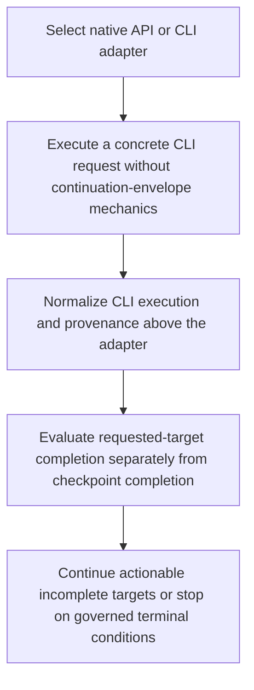

# Architect continuation boundary and autonomous completion

> Released in DreamGraph v13.2.0. The Architect controller selects native API or CLI execution. Native API paths may consume and emit continuation envelopes. CLI paths receive concrete tool requirements, execute directly, and return envelope-free normalized results. The controller evaluates requested-target completion separately from checkpoint completion and continues locally actionable autonomous work. Verified by the root suite, 471/471 extension tests, 123/123 scan/MCP release verification, builds, package audits, tag v13.2.0, GitHub release publication, and website commit eee06d7.

**Trigger:** Architect autonomous execution request 
**Source files:** src/architect/routes.ts, src/architect/continuation.ts, src/architect/cli-bridge.ts, extensions/vscode/src/autonomy.ts, extensions/vscode/src/autonomy-loop.ts, RELEASE_NOTES_v13.2.0.md 

## Flowchart

## Steps

### 1. Select native API or CLI adapter

### 2. Execute a concrete CLI request without continuation-envelope mechanics

### 3. Normalize CLI execution and provenance above the adapter

### 4. Evaluate requested-target completion separately from checkpoint completion

### 5. Continue actionable incomplete targets or stop on governed terminal conditions
